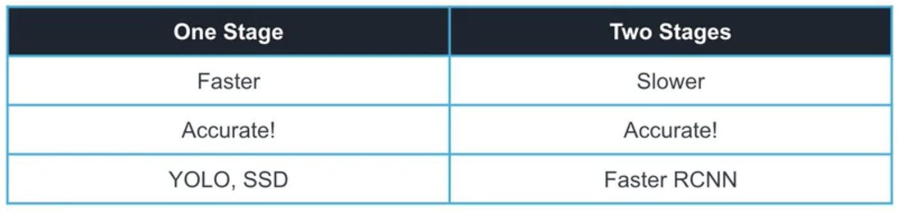
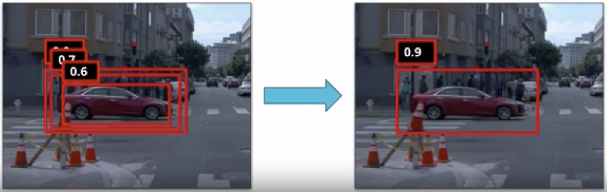
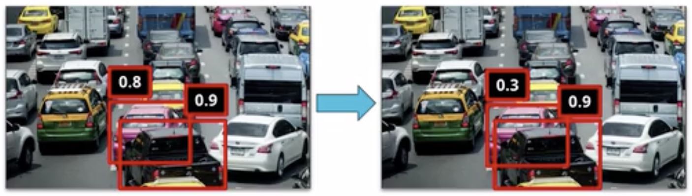
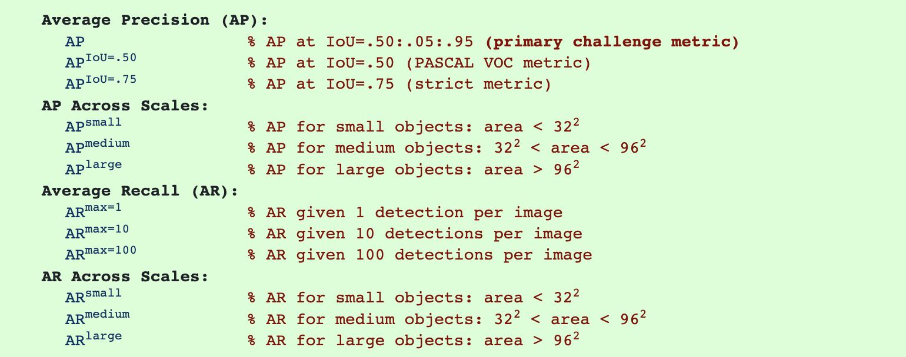
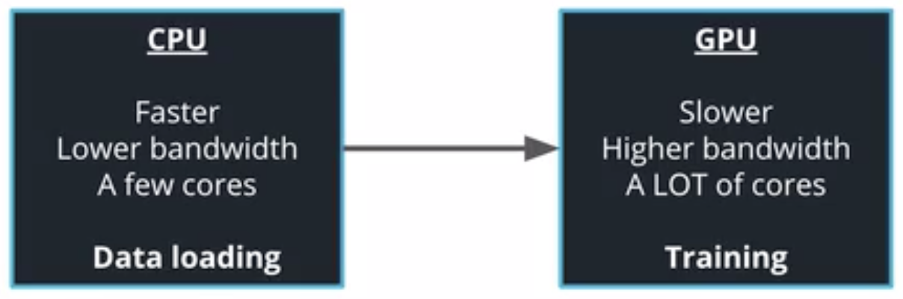

# OBJECT DETECTION IN IMAGES

## I. Region-based CNN (RCNN)

### 1. Selective search

The first iterations of object detection algorithms relied on selective search, an iterative algorithm that segment regions in an image.

The first paper of the **Region-Based CNN (RCNN)** family used regions created by selective search as inputs to a convolutional neural network. This [2014 paper](https://arxiv.org/pdf/1311.2524) takes the regions created by selective search and resizes them to a fixed size resolution before feeding it into a CNN.

Despite being a breakthrough in terms of performances, this architecture still has some downsides:

- The need to resize each region to fixed-size input.
- The need to recompute CNN features for each region.
- It is slow because it relies on selective search.

### 2. SPPNet

[SPPNet](https://arxiv.org/abs/1406.4729) introduced a new type of layer to remediate some of the issues of the RCNN architecture: the spatial pyramid pooling (SPP) layer. This layer takes a variable size input and creates a fixed-size input.

SPPNet also takes a different approach than RCNN by reusing the CNN feature. Indeed, instead of feeding the cropped input image, the entire image is fed to the CNN and the selective search regions are used to crop the final feature maps. These regions are then fed to a SPP layer. By doing so, SPPNet gets similar performances to RCNN while improving the inference time by almost 100 times.

### 3. Fast-RCNN

The [Fast RCNN](https://arxiv.org/pdf/1504.08083) improves over RCNN and SPPNet by:

- Using a multi-task loss and taking an end to end training approach.
- A single loss function is used for both classification of the object and regression of the bounding boxes. 
- Using region of interest (ROI) pooling, a 1 level SPP layer.

Therefore, the model can be trained as a single entity, instead of having to train the different modules separately.

### 4. Faster-RCNN

The [Faster RCNN architecture](https://arxiv.org/pdf/1506.01497) is the latest iteration of the RCNN family.

It improves over RCNN and FastRCNN by not relying on selective search. Instead, it uses a **Region Proposal Network (RPN)** to generate the ROIs. The RPN uses the feature maps of the last convolution layer to generate the ROIs. The RPN uses a sliding window over the feature maps and for each position of this window, it generates `k` anchor boxes. These anchors boxes are used to determine if the region contains an object or not.

Thanks to a multitask loss function, all the components of FasterRCNN are trained simultaneously.

## II. One-Stage Object Detection

Faster RCNN is a slow algorithm, and does not run in real-time (30 fps or faster). These models are called **two-stage object detection** which creates proposal regions then uses them to classify and detect objects. Improvements have been made to release **one-stage object detection**.

### 1. YOLO (You Only Look Once)

**You Only Look Once (YOLO)** takes a very different approach than **FasterRCNN**. Instead of relying on a region proposal step, the author of this [2016 paper](https://arxiv.org/pdf/1506.02640) directly split the input image into a grid. For each element of the grid, the network predicts `B` bounding boxes and objectness scores.

By getting rid of the region proposal step, YOLO provides much faster inference time than FasterRCNN (45 fps compared to 18 fps). However, it does not detect as good as FasterRCNN, as well as struggling with smaller objects. 

### 2. Non-Max Suppression (NMS)

**Non max suppression (NMS)** is a post-processing methods to remove redundant detections. From the Region Proposal Network in FasterRCNN, for each location of the sliding window, the network generates `k` anchor boxes. Because of that, object detection algorithms tend to output a large number of bounding boxes. By using the confidence score of each prediction, we can clean these predictions by removing high-overlapping / lower confidence predictions.

### 3. Soft-NMS

In this [2017 paper](https://arxiv.org/pdf/1704.04503), the authors argued that NMS could actually hurt the performance of object detection algorithm by removing predictions of highly occluded objects. Instead, they proposed the **Soft NMS** algorithm. Soft NMS does not remove predictions that highly overlap higher confidence predictions, but instead reduces their confidence score. By doing so, Soft NMS improves the performance of object detection algorithms in dense environments.

## III. Training tips

### 1. Mean Average Precision (mAP)

**Mean Average Precision (mAP)** is the to-go metric of the object detection task. You will find multiple variations of the mAP metric in the literature. 

### 2. Object Detection API

The **Tensorflow Object Detection API** provides a simple interface to develop and train object detection models in TensorFlow. It uses a single config file to describe the entire training pipeline, including the model architecture, the different datasets and hyperparameters.

**Tensorboard** is TensorFlow's custom dashboard to monitor the training of your models. You simply launch a Tensorboard server by running `tensorboard --logdir <LOGDIR>` where `LOGDIR` is the location of your log files.

### 3. Training Tips

#### a. CPU and GPU

Training a deep learning model requires data transfers from the **CPU** to the **GPU**. Such data transfers can create a bottleneck, slow down your training and cost you a lot of money. Because CPUs and GPUs have different limitations, it is critical to understand where your data is moving from one device to another and how to identify any potential problems with your training pipelines.

There are 2 useful tools to monitor and optimize the GPU effectively:

- `nvidia-smi`
- `nvtop`

#### b. During training

When training a NN model on a new problem, following these steps might save yourself headaches:

- Become one with the data. Study and analyze your dataset in as much depth as possible.
- Establish baselines.
- Check your training pipelines.
- Start with a simple model and don't use any training tricks, such as learning rate annealing.
- Iterate based on your results.

A good material: [A Recipe for Training Neural Networks](https://karpathy.github.io/2019/04/25/recipe/).

#### c. Learning rate annealing

There are 2 different learning rate annealing (decay) strategies:

- Step-wise Annealing
- Exponential Annealing

## Glossary

- **Mean Average Precision (mAP)**: an object detection metric.
- **Non-Max Suppression (NMS) and Soft-NMS**: post processing techniques to clean predictions of object detections algorithms.
- **nvtop**: a tool to monitor GPU usage.
- **Object detection task**: the task of detecting and classifying object in an image.
- **Region-based CNN (RCNN)**: two stage (or one stage in more recent versions) object detection algorithms family.
- **Region Of Interest (ROI)**: a region that may contain an object.
- **Spatial Pyramid Pooling (SPP) layer**: custom layer that outputs a fixed length vector given a variable sized input.
- **Tensorboard**: TensorFlow training monitoring dashboard.
- **Tensorflow Object Detection API**: a TensorFlow API to develop and train object detection algorithms.
- **You Only Look Once (YOLO)**: one stage object detector. Faster but less accurate than FasterRCNN.