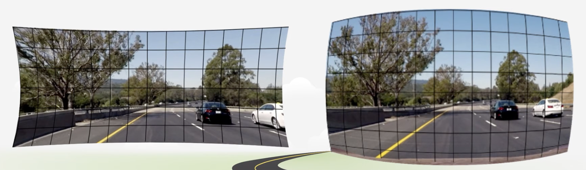
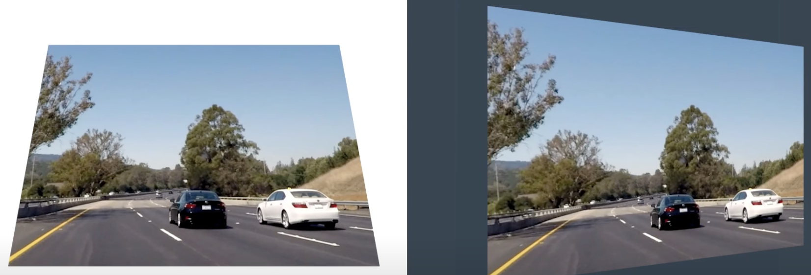
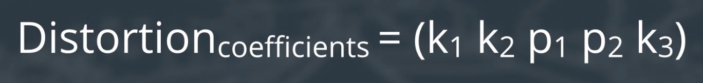
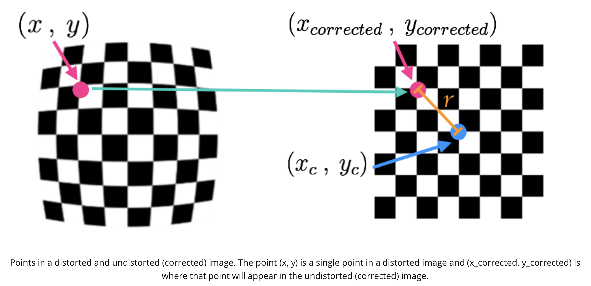
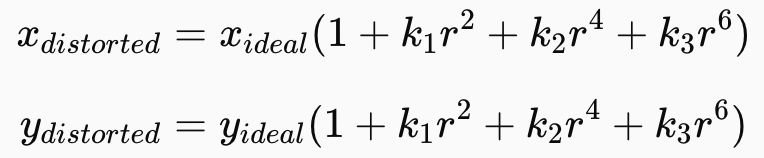
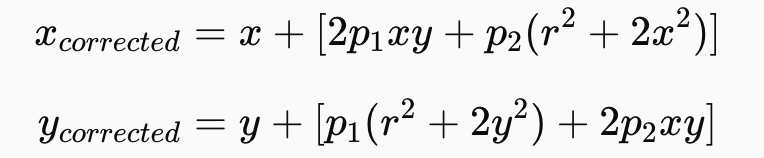
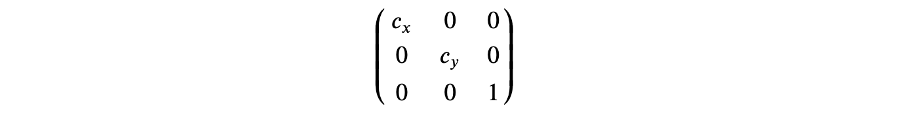
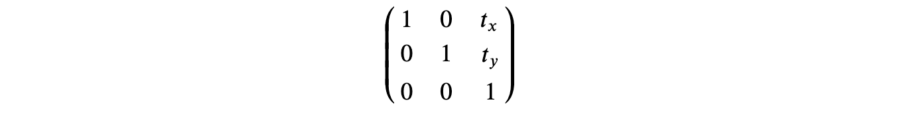
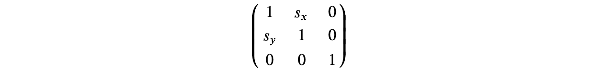

# SENSOR AND CAMERA CALIBRATION

## I. Distortion correction

Image distortion occurs when a camera looks at 3D objects in the real world and transforms them into a 2D image; this transformation isn’t perfect. Distortion actually changes what the shape and size of these 3D objects appear to be. So, the first step in analyzing camera images, is to undo this distortion so that you can get correct and useful information out of them.

## II. Types of distortion

### 1. Radial distortion

- The most common type of distortion.
- Real cameras use curved lenses to form an image, and light rays often bend a little too much or too little at the edges of these lenses.
- This creates an effect that distorts the edges of images, so that lines or objects appear more or less curved than they actually are.

### 2. Tangential distortion

- This occurs when a camera’s lens is not aligned perfectly parallel to the imaging plane, where the camera film or sensor is. 
- This makes an image look tilted so that some objects appear farther away or closer than they actually are.

### 3. Distortion coefficients

- There are three coefficients needed to correct for **radial distortion**: *k1*, *k2*, and *k3*. 
- There are two coefficients needed to correct for **tangential distortion**: *p1*, *p2*.
- To correct the appearance of radially distorted points in an image, one can use a correction formula.

In the following equations:
- $(x, y)$ is a point in a distorted image.
- A point in an undistorted (corrected) image $(x_{corrected}, y_{corrected})$.
- The center of the image distortion (sometimes referred as distortion center), which is often the center of that image $(x_c, y_c)$.
- To undistort these points, OpenCV calculates **r**, which is the known distance between those 2 points above.

#### a. Radial distortion correction

#### b. Tangential distortion correction

## III. Camera calibration

OpenCV's useful functions:
- Camera calibration, given object points, image points, and the shape of the grayscale image:
`ret, mtx, dist, rvecs, tvecs = cv2.calibrateCamera(objpoints, imgpoints, gray.shape[::-1], None, None)`
- Undistorting a test image:
`dst = cv2.undistort(img, mtx, dist, None, mtx)`

## IV. Transformation

### 1. Pixel model transformation

`Pillow` library can be used to do these tasks easily.

### 2. Geometric transformation

This section only introduces **affine transformation**, which is a geometric transformation that preserves lines and parallelism (but not necessarily distances and angles).

#### a. Resizing

#### b. Translation

#### c. Shear

