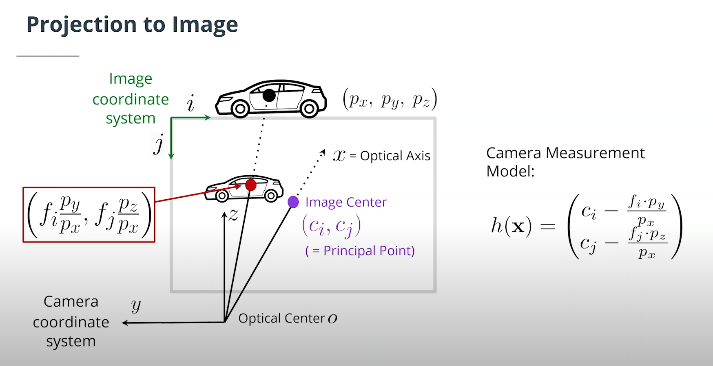

# EXTENDED KALMAN FILTER

## I. Sensor fusion overview

The Kalman Filter algorithm will go through the following steps to track an object over time:

- First measurement - the filter will receive initial measurements of the object's position relative to thecar. These measurements will come from a camera or lidar sensor.
- Initialize state and covariance matrices - the filter will initialize the object's position $\begin{bmatrix}p_x \\ p_y \end{bmatrix}$ and velocity 
$\begin{bmatrix}v_x \\ v_y \end{bmatrix}$ based on the first measurement.
- Then the car will receive another sensor measurement after a time period $Δt$.
- Predict - the algorithm will predict where the object will be after time $Δt$.
- Update - the filter compares the "predicted" location with what the sensor measurement says. The predicted location and the measured location are combined to give an updated location. The Kalman filter will put more weight on either the predicted location or the measured location depending on the uncertainty of each value. The update step is often also referred to as the innovation or correction step.
- Then the car will receive another sensor measurement after a time period $Δt$. The algorithm then does another predict and update step.

## II. Estimation problem refresh

### 1. Variable definitions

- x : state vector of $x = (p_x, p_y, v_x, v_y)$.
- Position and velocity are represented by a Gaussian distribution with mean **x**, Meanwhile, $P$ is the **estimation error covariance matrix**, which contains information about the uncertainty of the object's position and velocity. You can think of it as containing standard deviations.
- $k$ : time step index, so $x_k$ is the object's position and velocity at time $t_k$.
- $\Delta t$ : time step between 2 consecutive measurements.

### 2. Variable summary

### 3. Kalman filter equation summary

## III. State prediction

## IV. Process noise covariance Q

## V. Lidar measurement model

### 1. Variables summary

### 2. Measurement noise covariance matrix $R$ explanation

## VI. Camera refresh

### 1. Camera measurement model

