# DETECTING OBJECTS IN LIDAR

## I. SOTAs in 3D object detection

During processing pipeline for object detection and classification based on point-clouds, the pipeline structure consists of three major parts, which are:
1. Data representation
2. Feature extraction
3. Model-based detection

The following figure shows the data flow through the pipeline with raw point cloud on one end and the classified objects on the other end:

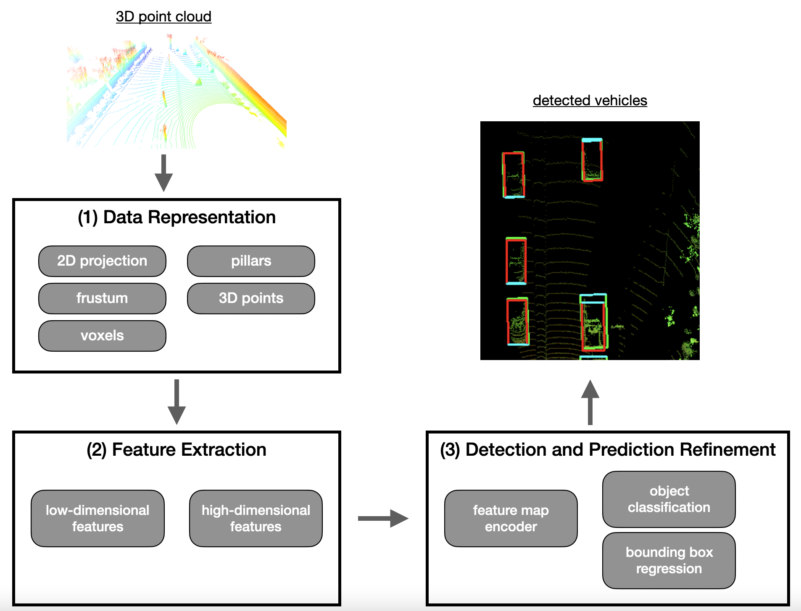

### Step 1. Data representation

As we have seen in the last lesson, lidar point clouds are an unstructured assortment of data points which are distributed unevenly over the measurement range. With the prevalence of convolutional neural networks (CNN) in object detection, point cloud representations are required to have a structure that suits the need of the CNN, so that convolution operations can be efficiently applied. Let us now have a look at the available methods:

#### a. Point-based data representation

Point-based methods take the raw and unfiltered input point cloud and transform it into a sparse representation, which essentially corresponds to a clustering operation, where points are assigned to the same cluster based on some criterion (e.g. spatial distance). In the next step, such methods extract a feature vector for each point by considering the neighboring clusters. Such approaches usually first look for low-dimensional local features for each single point and then aggregate them to larger and more complex high-dimensional features. One of the most prominent representatives of this class of approaches is [PointNet](https://arxiv.org/abs/1612.00593) by Qi et al., which has in turn inspired many other significant contributions such as [PointNet++](https://arxiv.org/abs/1612.00593) or [LaserNet](https://arxiv.org/abs/1903.08701).

One of the major advantages of point-based methods is that they leave the structure of the point cloud intact so that no information is lost, e.g. due to clustering.

However, one of the downsides of point-based approaches is their relatively high need for memory resources as a large number of points has to be transported through the processing pipeline.

#### b. Voxel-based data representation

A voxel is defined as a volume element in a three-dimensional grid in space. A voxel-based approach assigns each point from the input point cloud to a specific volume element. Depending on the coarseness of the voxel grid, multiple points may land within the same volume element. Then, in the next step, local features are extracted from the group of points within each voxel.

One of the most significant advantages of voxel-based methods is that they save memory resources as they reduce the number of elements that have to be held in memory simultaneously. Therefore, the feature extraction network will be computationally more efficient, because features are extracted for a group of voxels instead of extracting them for each point individually. A well-known representative of this class of algorithms is [VoxelNet](https://arxiv.org/abs/1711.06396). The following figure shows a point cloud whose individual points are clustered based on their spatial proximity and assigned to voxels. After the operation is complete, the amount of data representing the object has significantly decreased.

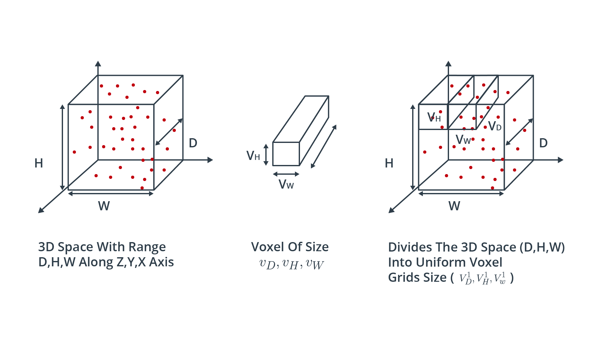

#### c. Pillar-based data representation

An approach very similar to voxel-based representation is the pillar-based approach. Here, the point cloud is clustered not into cubic volume elements but instead into vertical columns rising up from the ground up.

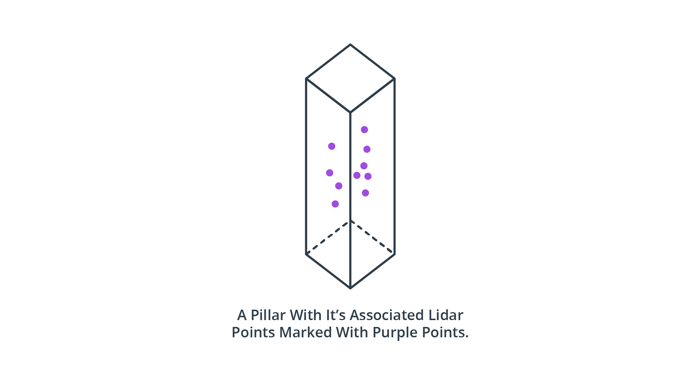

As with the voxel-based approach, segmenting the point cloud into discrete volume elements saves memory resources - even more so with pillars as there are usually significantly fewer pillars than voxels. A well-known detection algorithm from this class is [PointPillars](https://arxiv.org/abs/1812.05784).

#### d. Frustum-based data representation

When combined with another sensor such as a camera, lidar point clouds can be clustered based on pre-detected 2d objects, such as vehicles or pedestrians. If the 2d region around the projection of an object on the image plane is known, a frustum can be projected into 3D space using both the internal and the external calibration of the camera. One method belonging to this class is e.g. [Frustum PointNets](https://arxiv.org/pdf/1711.08488v1). The following figure illustrates the principle.

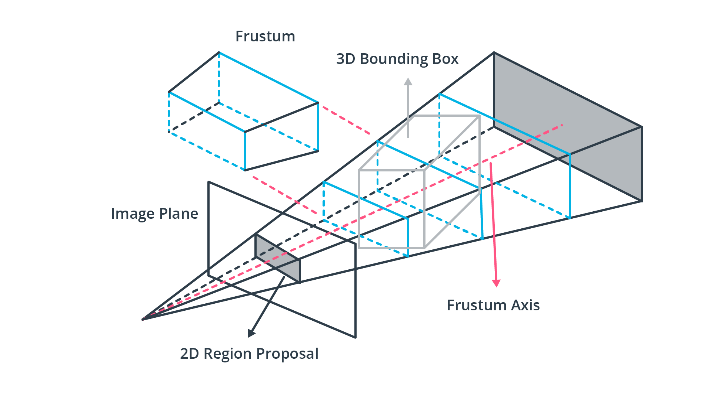

One obvious disadvantage of this method when compared to the previous ones is that it requires a second sensor such as a camera. However, as these are already used for object detection in autonomous driving and guaranteed to be on-board a vehicle, this is not a significant downside.

#### e. Projection-based data representation

While both voxel- and pillar-based algorithms cluster the point-cloud based on a spatial proximity measure, projection-based approaches reduce the dimensionality of the 3D point cloud along a specified dimension. In the literature, three major approaches can be identified, which are front view (RV), range view (RV) and bird's eye view (BEV). In the FV approaches, the point cloud is compacted along the forward-facing axis while with BEV images, points are projected onto the ground plane. The following figure illustrates both methods.

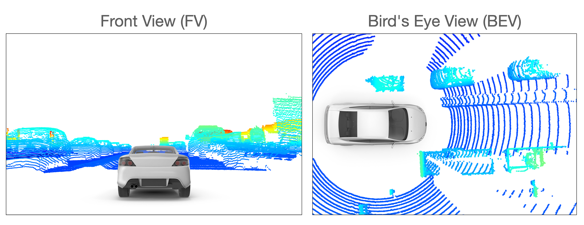

RV methods are very similar to the FV approach with the exception that the point cloud is not projected onto a plane but onto a panoramic view instead. As you will recall from the previous lesson, this concept is the one implemented in the Waymo dataset, in which lidar data is stored as range images.

In the literature, BEV is the projection scheme most widely used. The reasons for this are three-fold: (1) The objects of interest are located on the same plane as the sensor-equipped vehicle with only little variance. Also, (2) the BEV projection preserves the physical size and the proximity relations between objects, separating them more clearly than with both the FV and the RV projection. In the next chapter, we will implement the BEV projection as the basis for the object detection method used in this course.

### Step 2. Feature extraction

After the point cloud has been transformed into a suitable representation (such as a BEV projection), the next step is to identify suitable features. Currently, feature extraction is one of the most active research areas and significant progress has been made there in the last years, especially in improving the efficiency of the object detector models. The type of features that are most commonly used are (1) local, (2) global and (3) contextual features:

- Local features, which are often referred to as low-level features are usually obtained in a very early processing stage and contain precise information e.g. about the localization of individual elements of the data representation structure.
- Global features, which are also called high-level-features, often encode the geometric structure of an element within the data representation structure in relation to its neighbors.
- Contextual features are extracted during the last stage of the processing pipeline. These features aim at being accurately located and having rich semantic information such as object class, bounding box shape and size and the orientation of the object.

In the following, we will look at a number of feature extractor classes found in the current literature:

#### a. Point-wise feature extractors

The term "point-wise" refers to the fact that the entire point cloud is used as input. This approach is obviously suited for the point-based data representation from the first step. Point-wise feature extractors analyze and label each point individually, such as in PointNet and PointNet++, which currently are among the most well-known feature extractors. To illustrate the principle, let us briefly look at the PointNet architecture, which is illustrated in the following figure:

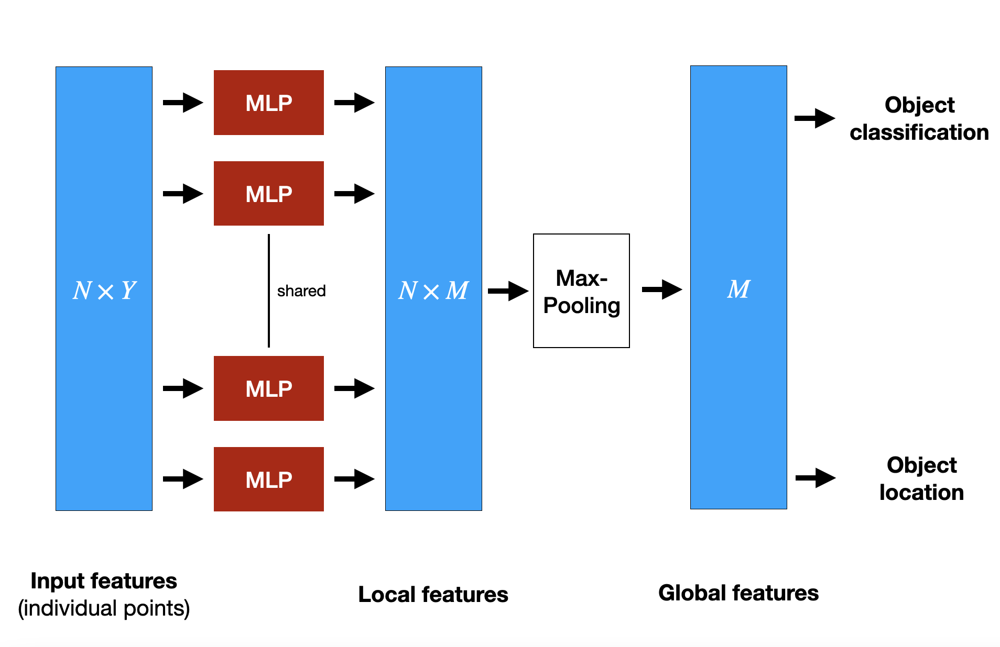

PointNet uses the the entire point cloud as input. It extracts global structures from spatial features of each point within a subset of points in Euclidean space. To achieve this, PointNet implements a non-hierarchical neural network that consists of the three main blocks, which are a max-pooling layer, a structure for combining local and global information and two networks that align the input points with the extracted point features. In the diagram, $N$ refers to the number of points that are fed into PointNet and $Y$ is the dimensionality of the features. In order to extract features point-wise, a set of multi-layer perceptrons (MLP) is used to map each of the $N$ points from three dimensions $(x,y,z)$ to 64 dimensions. This procedure is then repeated to map the $N$ points from 64 dimensions to $M = 1024$ dimensions. When this is done, max-pooling is used to create a global feature vector in $R^1024$. Finally, a three-layer fully-connected network is used to map the global feature vector to generate both object classification and object location.

One of the downsides of PointNet is its inability to capture local structure information between neighboring points, since features are learned individually for each point and the relation between points is ignored. This has been improved e.g. in PointNet++, but for reasons of brevity we will not go into further details here. Even though point-wise feature extractors show very promising results, they are not yet suitable for use in autonomous driving due to high memory requirements and computational complexity.

#### b. Segment-wise feature extractors

Due to the high computational complexity of point-based features, alternative approaches are needed so that object detection in lidar point clouds can be used in a real-time environment. The term "segment-wise" refers to the way how the point cloud is divided into spatial clusters (e.g. voxels, pillars or frustums). Once this has been done, a classification model is applied to each point of a segment to extract suitable volumetric features. One of the most-cited representatives of this class of feature extractors is [VoxelNet](https://arxiv.org/abs/1711.06396). In a nutshell, the idea of VoxelNet is to encode each voxel via an architecture called "Voxel Feature Extractor (VFE)" and then combine local voxel features using 3D convolutional layers and then transform the point cloud into a high dimensional volumetric representation. Finally, a region proposal network processes the volumetric representation and outputs the actual detection results.

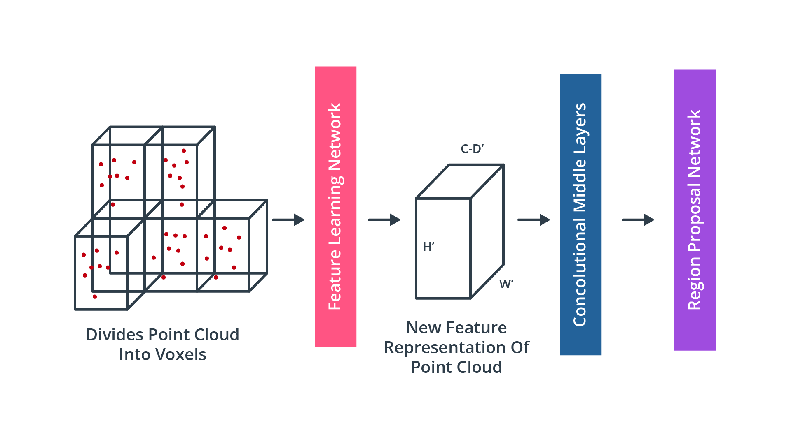

To illustrate the concept, the figure below shows the architecture of the [Voxel Feature Extractor](https://arxiv.org/abs/1711.06396) within the feature learning network shown in the previous diagram:

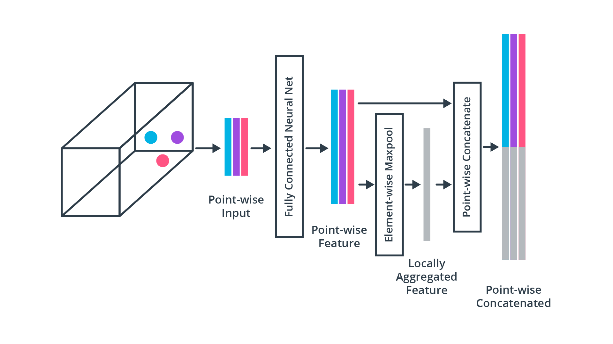

As this chapter is intended to provide a broad overview of the literature, we will not go into further details on VoxelNet or VFE. If you would like to see the algorithm in action, please refer to this [unofficial implementation](https://github.com/qianguih/voxelnet).

#### c. Convolutional Neural Networks (CNN)

In CNN-based object detection methods, the processing pipeline relies heavily on the use of "backbone networks", which serve as basic elements to extract features. This approach allows for the adaptive and automatic identification of features without the need to invest manual (and thus often heuristic) engineering efforts as with many classic approaches. In most cases, the backbone networks used for image-based object detection can be directly used for point clouds as well. In order to balance between detection accuracy and efficiency, the type of backbones can be chosen between deeper and densely connected networks or lightweight variants with few connections.

Even though the results achieved with CNNs such as [AlexNet](https://papers.nips.cc/paper/2012/file/c399862d3b9d6b76c8436e924a68c45b-Paper.pdf) were stunning at the time, these networks had the problem that with the network depth increasing, the accuracy of detection became saturated and degraded rapidly, due to a problem referred to as [vanishing gradients](https://towardsdatascience.com/the-vanishing-gradient-problem-69bf08b15484). This problem generally occurred in all architectures with a high number of layers, i.e. in all "deep" networks. To overcome this problem, the ResNet architecture was proposed by He et al. in [this paper](https://arxiv.org/abs/1512.03385), which used "skip connections" (i.e. shortcuts) to directly pass values of one layer to the next layer without using a non-linear transformation. By using such shortcuts, gradients can be directly propagated, leading to significant reductions in training difficulty. This means that network depth can be increased without compromising the model’s training capabilities. In the mid-term project, you will be using a ResNet model to perform object detection on point clouds.

### Step 3. Detection and Prediction Refinement

Once features have been extracted from the input data, a detection network is needed to generate contextual features (e.g. object class, bounding box) and finally output the model predictions. Depending on the architecture, the detection process can either perform a single-pass or a dual-pass. Based on the detector network architecture, the available types can be broadly organized into two classes, which are dual-stage encoders such as R-CNN, Faster R-CNN or PointRCNN or single-stage encoders such as YOLO or SSD. In general, single-stage encoders are faster than dual-stage encoders, which makes them more suited for real-time applications such as autonomous driving.

A problem faced by CNN-based object detection is that we do not know how many instances of a certain object type are located within the input data. It could be that only a single vehicle is visible in the point cloud, or it could also be 10 vehicles. A naive approach to solve this problem would be to apply a CNN to multiple regions and check for the presence of objects within each region individually. However, as objects will have different locations and shapes, one would have to select a very large number of regions, which quickly becomes computationally infeasible.

To solve this problem, Ross Girshick et al. proposed a method (R-CNN) where a selective search is used to extract ~2000 regions, which he called region proposals. This meant a significant decrease in the number of regions that needed to be classified. Note that in the original publication, the input data were camera images and not point clouds. The candidate regions are then fed into a CNN to produce a high-dimensional feature vector, from which the presence of objects within the candidate regions is inferred using a support vector machine (SVM). The following figure illustrates the process:

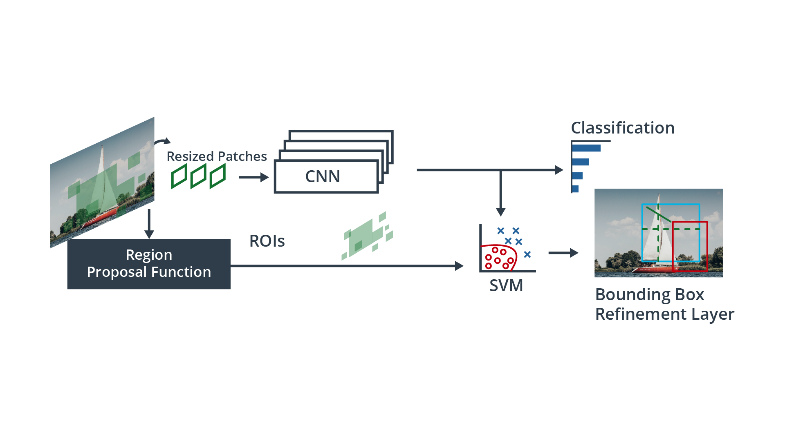


In order to refine the predictions and increase the accuracy of the model output, dual-stage encoders feed the results from the first stage to an additional detection network which refines the predictions by combining different feature types to produce refinement results.

Single-stage object detectors on the other hand perform region proposal, classification and bounding box regression all in one step, which makes them significantly faster and thus more suitable for real-time applications. In many cases though, two-stage detectors tend to achieve better accuracy.

One of the most famous single-stage detectors is YOLO (You Only Look Once). This model runs a deep learning CNN on the input data to produce network predictions. The object detector decodes the predictions and generates bounding boxes, as shown in the figure below:

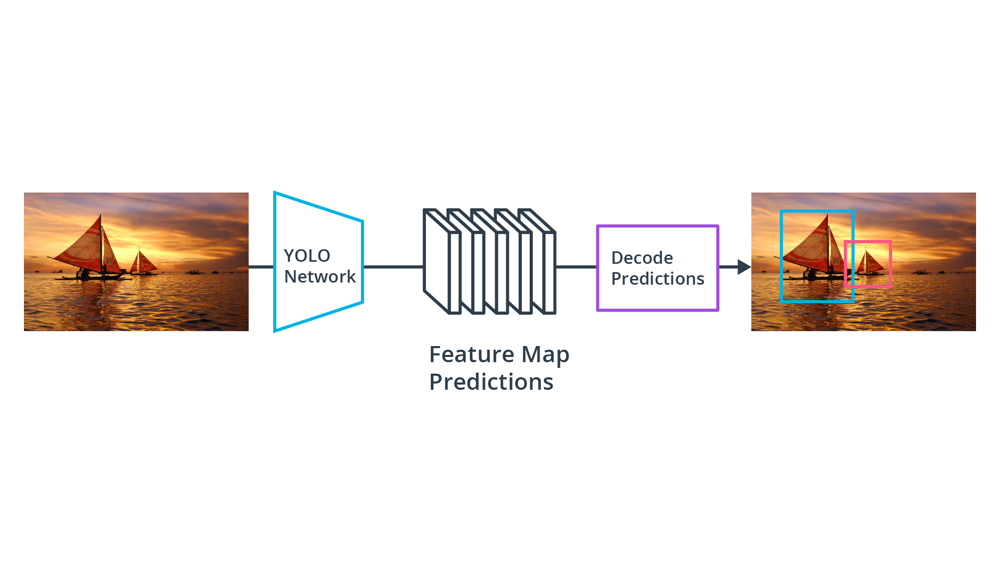

YOLO uses anchor boxes to detect classes of objects, which are predefined bounding boxes of a specific height and width. These boxes are defined to capture the scale and aspect ratio of specific object classes (e.g. vehicles, pedestrians) and are typically chosen based on object sizes in the training dataset. During detection, the predefined anchor boxes are tiled across the image. The network predicts the probability and other attributes, such as background, intersection over union (IoU) and offsets for every tiled anchor box. The predictions are used to refine each individual anchor box.

When using anchor boxes, you can evaluate all object predictions at once without the need for a sliding-window as with many classical applications. An object detector that uses anchor boxes can process the entire input data at once, making real-time object detection systems possible.

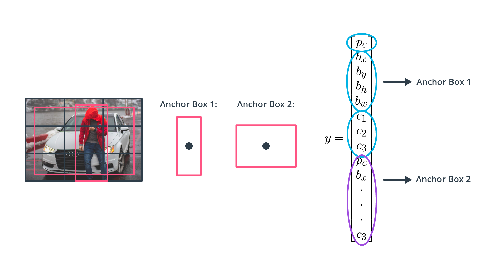

The network returns a unique set of predictions for every anchor box defined. The final feature map represents object detections for each class. The use of anchor boxes enables a network to detect multiple objects, objects of different scales, and overlapping objects.

As stated before, most of the CNN-based approaches originally come from the computer vision domain and have been developed with image-based detection in mind. Hence, in order to apply these methods to lidar point clouds, a conversion of 3d points into a 2d domain has to be performed. Which is exactly what we will be doing in the next chapter on object detection in point clouds.

## II. Real-time 3D object detection on point clouds

### 1. The Complex YOLO Algorithm

In the paper [Complex-YOLO: Real-time 3D Object Detection on Point Clouds](https://arxiv.org/abs/1803.06199), M. Simon et al. extend the famous YOLO network for bounding box detection in 2D images to 3D point clouds. As can be seen from the following figure, the main pipeline of Complex YOLO consists of three steps:

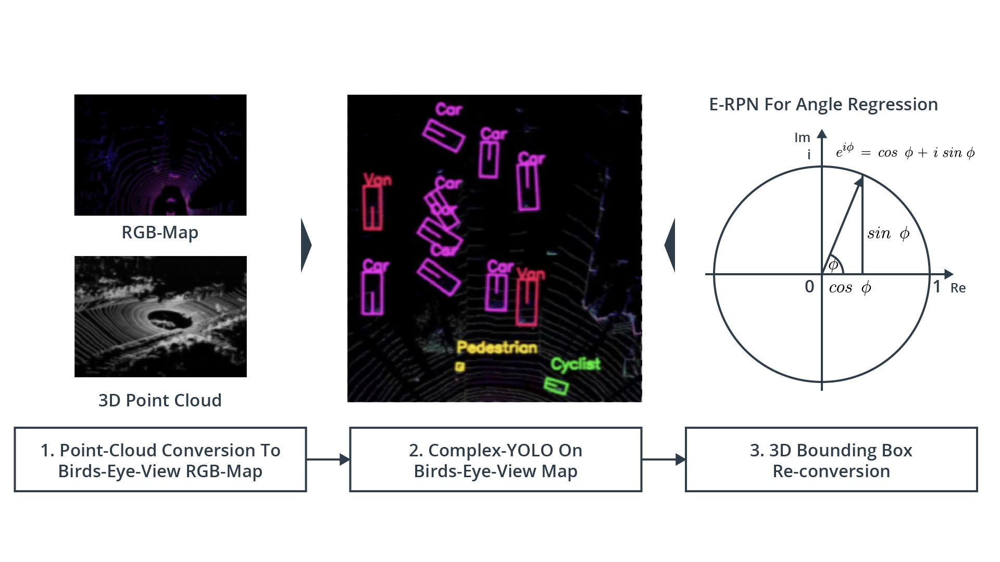

#### a. Transforming the point cloud into a bird's eye view (BEV)

First, the 3D point cloud is converted into a bird's eye view (BEV), which is achieved by compacting the point cloud along the upward-facing axis (the z-axis in the Waymo vehicle coordinate system). The BEV is divided into a grid consisting of equally sized cells, which enables us to treat it as an image, where each pixel corresponds to a region on the road surface. As can be seen from the following figure, several individual points often fall into the same grid element, especially on surfaces that are orthogonal to the road surface. The following figure illustrates the concept:

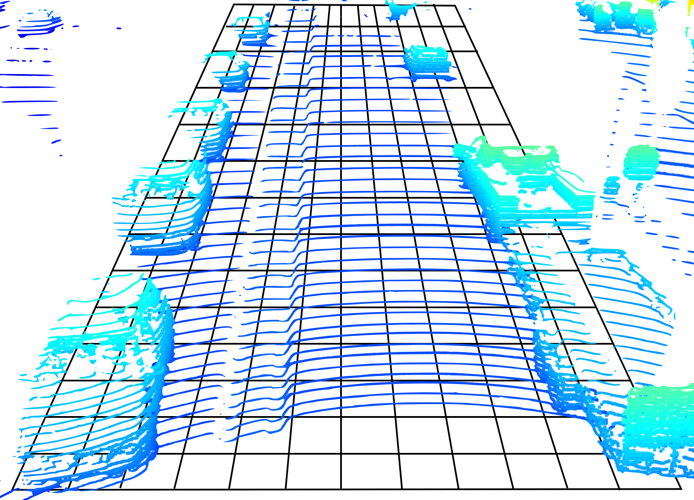

As can be seen, the density of points varies strongly between cells, depending on the presence of objects in the scene. While on the road surface, the number of points is comparatively low due to the angular resolution in vertical direction (64 laser beams), the number of points on the front, back or side of a vehicle is much higher as neighboring vertical LEDs are reflected from the same distance. This means that we can derive three pieces of information for each BEV cell, which are the intensity of the points, their height and their density. Hence, the resulting BEV map will have three channels, which from the perspective of the detection network, makes it a color image.

The process of generating the BEV map is as follows:

1. First, we need to decide the area we want to encompass. For the object detection in this course, we will set the longitudinal range to 0...50m and the lateral range to -25...+25m. The rationale for choosing this particular set of parameters is based partially on the original paper as well as on design choices in existing implementations of Complex YOLO.
2. Then, we divide the area into a grid by specifying either the resolution of the resulting BEV image or by defining the size of a single grid cell. In our implementation, we are setting the size of the BEV image to 608 x 608 pixels, which results in a spatial resolution of ≈8cm.
3. Now that we have divided the detection area into a grid, we need to identify the set of points $P_{ij}$ that falls into each cell, where $i,j$ are the respective cell coordinates. In the following, we will be using $N_{i,j}$ to refer to the number of points in a cell. As proposed in the original paper, we will assign the following information to the three channels of each cell:
    - Height $H_{i,j} = max(P_{i,j} \cdot [0,0,1]T)$
    - Intensity $I_{i,j} = max(I(P_{i,j}))$
    - Density $D_{i,j} = min(1.0, \frac{log(N+1)}{64})$

As you can see, $H_{i,j}$ encodes the maximum height in a cell, $I_{i,j}$ the maximum intensity and $D_{i,j}$ the normalized density of all points mapped into the cell. The resulting BEV image (which you will be creating in the second part of this chapter) looks like the following:

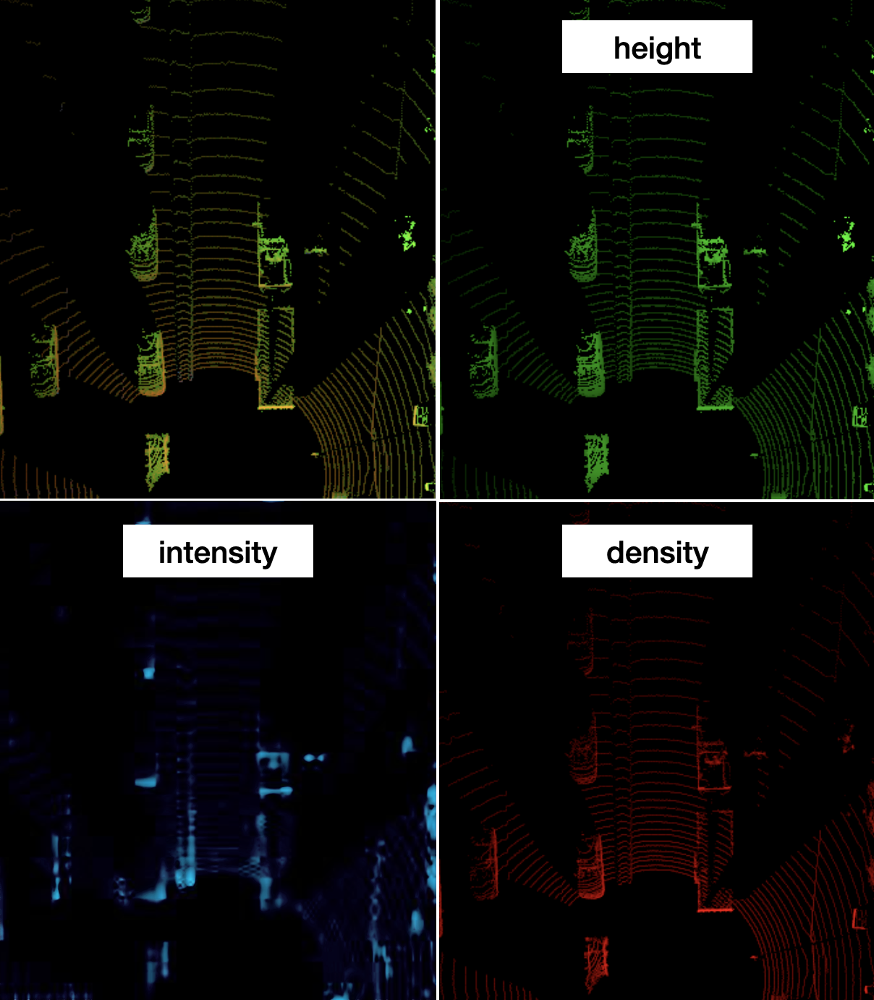


On the top-left, you can see the BEV map with all three channels superimposed. On the top right you can observe the height coded in green. It can clearly be seen that the roofs of the vehicles have a higher intensity than the road surface. On the lower left, you can see the intensity in blue. Depending on the contrast of your screen, you might be able to distinguish objects such as rear lights or license plates. If not, don't worry, we will investigate this more closely further on in this chapter. Finally, on the lower right, the point cloud density is displayed in red and it can clearly be seen that vehicle sides, fronts and rears show up the most. Also, with increasing distance, the point density on the road surface gets smaller, which obviously is related to perspective effects and the vertical angular resolution of the lidar.

### 2. Complex YOLO on BEV map

Let us now take a look at the network architecture, which can be seen in the following figure:

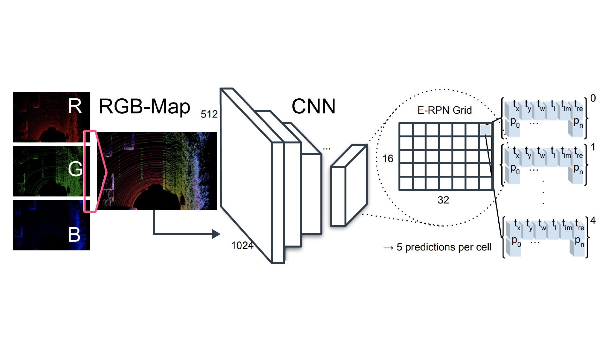

In the original publication, a simplified YOLOv2 CNN architecture has been used. Note that in our implementation in the mid-term project we will be using [YOLOv4](https://arxiv.org/abs/2004.10934) instead. Extensions to the original YOLO network are a complex angle regression and an Euler-Region Proposal Network (E-RPN), which serve to obtain the direction of bounding boxes around detected objects.

The YOLO Network has been configured to divide the image into a 16 x 32 grid and predicts 75 features. The model has a total of 18 convolutional layers and 5 pooling layers. Also, there are 3 intermediate layers, which are used for feature reorganization. More details on the network layout can be obtained from the original publication (table 1).

Let us discuss how the features per grid cell are obtained:

- The YOLO network predicts a fixed set of boxes per cell, in this case 5. For each box, 6 individual parameters are obtained, which are its two-dimensional position in the BEV map, its width and length and two components for the orientation angle: $[x,y,w,l,\alpha_{Im},\alpha_{Re}]$
- In addition to the box parameters, there is one parameter to indicate whether the bounding box contains an actual object and is accurately placed. Also, there are three parameters to indicate whether a box belongs to the classes "car", "pedestrian" or "bicycle".
- Finally, there are the 5 additional parameters used by the Region Proposal Network to estimate accurate object orientations and boundaries.

### 3. 3D bounding box re-conversion

One of the aspects that makes Complex YOLO special is the extension of the classical Grid RPN approach, which estimates only bounding box location and shape, by an orientation angle, which it encodes as a complex angle in Euler notation (hence the name "E-RPN") such that the orientation may be reconstructed as $arctan2(Im,Re)$. The following figure shows the parameters estimated during the bounding box regression:

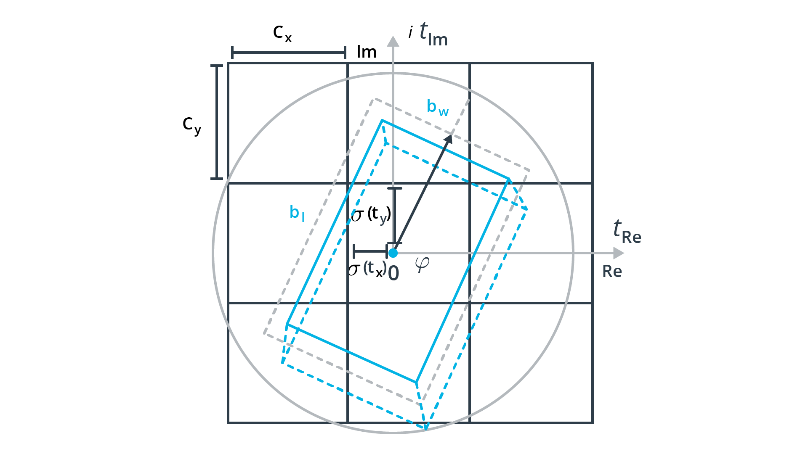

The regression values are then directly passed to the computation of a loss function, which is based on the YOLO concept (i.e. the sum of squared errors) using [multi-part loss](https://arxiv.org/pdf/1912.12355v1) but extends it by an Euler regression part, which is obtained by calculating the difference between the ground truth and predicted angle which is always assumed to be inside the circle shown above.

### 4. Why use Complex YOLO?

One of the major advantages of the Complex YOLO networks is its speed in comparison to other currently available methods. As can be seen from the following graph, the achievable frame rate of Complex YOLO is significantly higher than e.g. PointNet or VoxelNet while achieving a similar detection performance. This makes it well suited for real-time applications such as autonomous vehicles. Note that the term "mean Average Precision (mAP)" used in the figure will be explained thoroughly in the next chapter.

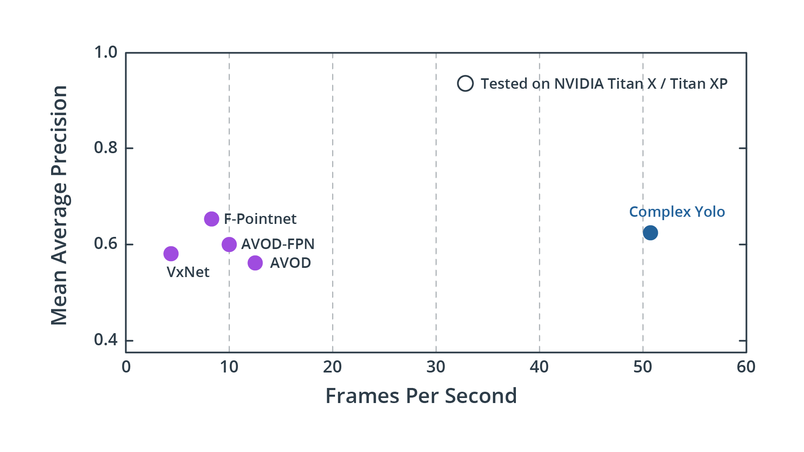

One disadvantage of the current implementation of Complex YOLO though is the lack of bounding box height and vertical position. All bounding boxes are assumed to be located on the road surface and height is set to a pre-defined constant based on the detection class. In the tracking stage, this might lead to inaccuracies for driving scenarios with varying elevation. An improved version of Complex YOLO, which extends the concept to full 3D is described in [this paper](https://arxiv.org/pdf/1808.02350v1).

## III. Transform Point Cloud into BEV

### 1. Creating BEV map for Complex YOLO

In this section, we will be creating the actual bird's eye view from lidar point clouds. As outlined prior in this chapter, this process follows a series of steps, which are:
- Filtering all the points which are outside of a defined area.
- Creating the actual BEV MAP by dividing the defined area into cells and by converting the metric coordinates of each point into grid coordinates.
- Computing height, intensity and density for each cell and converting the resulting values into 8 bit integers.

Let us start with the first step and remove all points from the lidar point cloud which do not fulfill the following criteria:
- $0m <= p_x >= +50m$
- $-25m <= p_y >= +25m$
- $-1m <= p_7 >= +3m$

As mentioned previously, the parameters have been chosen based on the original publication and on existing implementations of the algorithms.

Next, we can use `np.where` to retrieve the points whose coordinates are within these limits:

```
mask = np.where(
    (lidar_pcl[:, 0] >= lim_x[0]) & (lidar_pcl[:, 0] <= lim_x[1]) &
	(lidar_pcl[:, 1] >= lim_y[0]) & (lidar_pcl[:, 1] <= lim_y[1]) &
	(lidar_pcl[:, 2] >= lim_z[0]) & (lidar_pcl[:, 2] <= lim_z[1])
)
lidar_pcl = lidar_pcl[mask]
```

For the pre-defined limits, the resulting point cloud looks like the following:

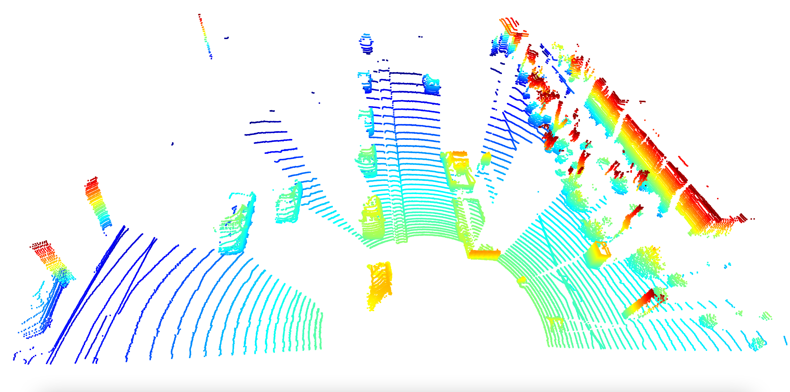

Changing the limits to a more restrictive setting has an immediate effect on the number of remaining points, as can be seen from the following image:

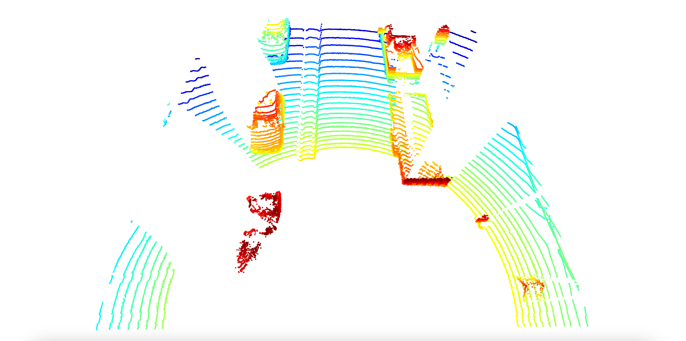

In the next step, we will create the BEV map by first discretizing the cells and then converting the point coordinates from vehicle space to BEV space. The following code gives you the dimensions of a single BEV cell in `meters/pixel`:

```python
bev_width = 608
bev_height = 608
bev_discret = (lim_x[1] - lim_x[0]) / bev_height
```

### 2. Code to transform point cloud to BEV

```python
def pcl_to_bev(lidar_pcl, configs, vis=True):

    # compute bev-map discretization by dividing x-range by the bev-image height
    bev_discret = (configs.lim_x[1] - configs.lim_x[0]) / configs.bev_height

    # create a copy of the lidar pcl and transform all metrix x-coordinates into bev-image coordinates    
    lidar_pcl_cpy = np.copy(lidar_pcl)
    lidar_pcl_cpy[:, 0] = np.int_(np.floor(lidar_pcl_cpy[:, 0] / bev_discret))

    # transform all metrix y-coordinates as well but center the foward-facing x-axis on the middle of the image
    lidar_pcl_cpy[:, 1] = np.int_(np.floor(lidar_pcl_cpy[:, 1] / bev_discret) + (configs.bev_width + 1) / 2)

    # shift level of ground plane to avoid flipping from 0 to 255 for neighboring pixels
    lidar_pcl_cpy[:, 2] = lidar_pcl_cpy[:, 2] - configs.lim_z[0]  

    # re-arrange elements in lidar_pcl_cpy by sorting first by x, then y, then by decreasing height
    idx_height = np.lexsort((-lidar_pcl_cpy[:, 2], lidar_pcl_cpy[:, 1], lidar_pcl_cpy[:, 0]))
    lidar_pcl_hei = lidar_pcl_cpy[idx_height]

    # extract all points with identical x and y such that only the top-most z-coordinate is kept (use numpy.unique)
    _, idx_height_unique = np.unique(lidar_pcl_hei[:, 0:2], axis=0, return_index=True)
    lidar_pcl_hei = lidar_pcl_hei[idx_height_unique]

    # assign the height value of each unique entry in lidar_top_pcl to the height map and 
    # make sure that each entry is normalized on the difference between the upper and lower height defined in the config file
    height_map = np.zeros((configs.bev_height + 1, configs.bev_width + 1))
    height_map[np.int_(lidar_pcl_hei[:, 0]), np.int_(lidar_pcl_hei[:, 1])] = lidar_pcl_hei[:, 2] / float(np.abs(configs.lim_z[1] - configs.lim_z[0]))
    
    # sort points such that in case of identical BEV grid coordinates, the points in each grid cell are arranged based on their intensity
    lidar_pcl_cpy[lidar_pcl_cpy[:,3]>1.0,3] = 1.0
    idx_intensity = np.lexsort((-lidar_pcl_cpy[:, 3], lidar_pcl_cpy[:, 1], lidar_pcl_cpy[:, 0]))
    lidar_pcl_cpy = lidar_pcl_cpy[idx_intensity]

    # only keep one point per grid cell
    _, indices = np.unique(lidar_pcl_cpy[:, 0:2], axis=0, return_index=True)
    lidar_pcl_int = lidar_pcl_cpy[indices]

    # create the intensity map
    intensity_map = np.zeros((configs.bev_height + 1, configs.bev_width + 1))
    intensity_map[np.int_(lidar_pcl_int[:, 0]), np.int_(lidar_pcl_int[:, 1])] = lidar_pcl_int[:, 3] / (np.amax(lidar_pcl_int[:, 3])-np.amin(lidar_pcl_int[:, 3]))

    # visualize intensity map
    if vis:
        img_intensity = intensity_map * 256
        img_intensity = img_intensity.astype(np.uint8)
        while (1):
            cv2.imshow('img_intensity', img_intensity)
            if cv2.waitKey(10) & 0xFF == 27:
                break
        cv2.destroyAllWindows()
```

## IV. Intensity channels

Now that we have created the first layer of the bird's eye view, let us take a look at the intensity channel in the following. As with height, the idea is to store the value with maximum intensity in each cell. Note that using the intensity values of the points we have previously selected based on maximum height will not work as in most cases, the highest point of a cell will not at the same time also have the highest intensity. Instead, we need to perform the sorting process once more, this time based on intensity rather than height.

One problem you will encounter in practice when dealing with LiDAR sensors is that the reflected intensity differs significantly between sensor models. When comparing the Velodyne LiDAR used in the KITTI dataset with the Waymo lidar, you will note that the maximum intensity values present in a scene is significantly higher with the Waymo sensor in most cases.

When you process the first 5 frames of sequence 3 for example, the output will look like the following:

```bash
processing frame #0
min. intensity = 0.0002117156982421875, max. intensity = 91648.0
------------------------------
processing frame #1
min. intensity = 0.000316619873046875, max. intensity = 86528.0
------------------------------
processing frame #2
min. intensity = 0.0003261566162109375, max. intensity = 80384.0
------------------------------
processing frame #3
min. intensity = 0.000209808349609375, max. intensity = 75776.0
------------------------------
processing frame #4
min. intensity = 0.00019168853759765625, max. intensity = 70656.0
------------------------------
processing frame #5
min. intensity = 0.00023746490478515625, max. intensity = 66048.0
```

As you can see, the difference between min. and max. intensities spans a total of 8 powers of ten. Let us investigate this observation a little more closely. We can copy and adjust the code we have used for creating the height map to now create the intensity map. Note that the code is not provided here as the creation of the intensity map is one of the exercises in the mid-term project.

Now please take a look at the intensity map given below.

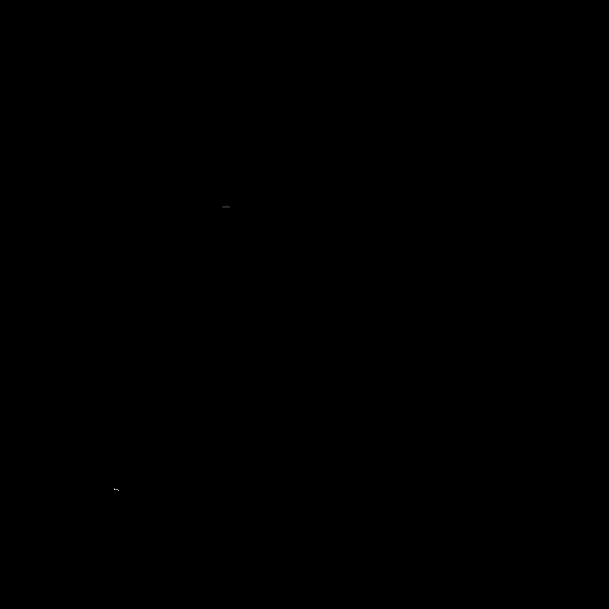

We can see that only a very small number of pixels is visible while the vast majority of projected 3d points has a brightness value of zero. Based on the value range which we exposed by printing the min. and max. intensities, it is clear that the intensity channel is dominated by only a few high-intensity points. Let us investigate this observation further and compute a histogram of the intensity values:

```python
b = np.array([0, 1e-5, 1e-4, 1e-3, 1e-2, 1e-1, 1, 1e+1, 1e+3, 1e+3, 1e+4, 1e+5, 1e+6, 1e+7])
hist,bins = np.histogram(lidar_pcl[:,3], bins=b)
print(hist)
```

Note that the bins are not equally spaced, but represent a logarithmic scale. This will help us to find the decade, which holds most of the intensity values. The output of the code looks like this:

```python
hist = [0, 0, 40, 5722, 15258, 9886, 49, 70, 0, 62, 70, 0, 0]
```

Based on these numbers, we can clearly see that the vast majority of intensity values lies between 0.001 and 1.0. As the number of points with higher intensity amounts to less than 1% of the data, we can safely perform a filtering operation such that each point with an intensity above 1.0 is clipped to 1.0:

```python
idx_limit = lidar_pcl[:,3]>1.0
lidar_pcl[idx_limit,3] = 1.0
```

Now, the dominating influence of overly large intensity has been removed. When we now compute the intensity map again, the result looks like the following:

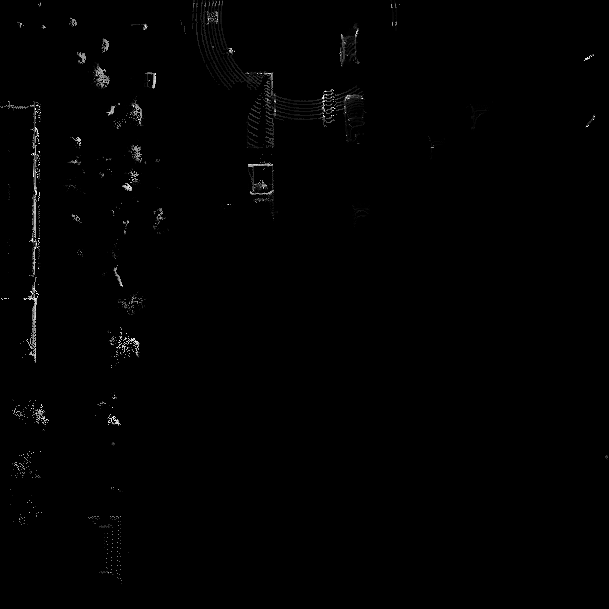

While the contrast of the BEV map has been slightly boosted to make more details visible to you, it can clearly be seen that the number of visible points is considerably higher, which will make it easier for the object detection network to locate vehicles based on the intensity of the reflected lidar pulses.

## V. Evaluating Object Detection Performance

In many papers, rankings and challenges such as the Waymo Open Challenge or the KITTI 3D Object Detection Benchmark, metrics such as "Average Precision" (AP) and "mean Average Precision" (mAP) are often used as the de-facto standard for comparing detection algorithms in a meaningful way. The following figure shows the leaderboard of the Waymo Open Challenge:

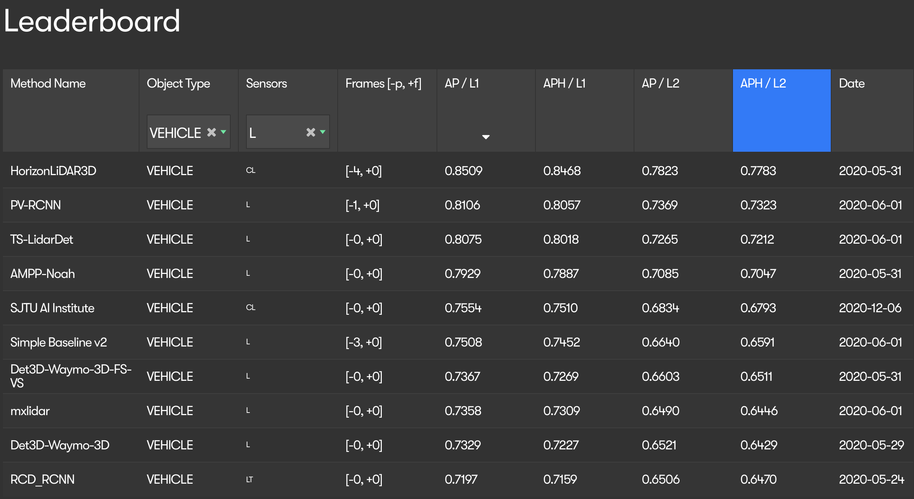

The board is sorted after the AP/L1 column, which ranks the various algorithms using a single number between 0.0 and 1.0. This chapter will be about carefully explaining the AP and mAP metric and their relevance for object detection.

### 1. Evaluating object detectors

Consider the following point cloud:

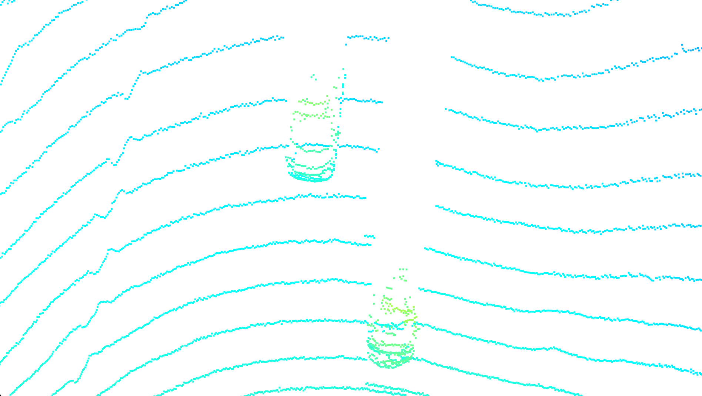

As can be seen in the image, two vehicles are present in the scene. Object detection algorithms need to perform two main tasks, which are:

1. To decide whether an object exists in the scene
2. To determine the position, the orientation and the shape of the object

The first task is called "classification", while the second task is most often referred to as "localization". In real-life scenarios, a scene will consist of several object classes (e.g. vehicles, pedestrians, cyclists, traffic signs), which leads to the necessity of assigning a confidence score to each detected object, usually in the range between 0.0 and 1.0. Based on this score, the detection algorithm can be assessed at various confidence levels, which means that the threshold for accepting or rejecting an object is systematically varied.

In order to address these issues, the Average Precision (AP) metric was proposed as a suitable metric for object detection. To understand the concept behind AP, you first need to understand the terms "precision" and "recall" as well as the four characteristics "true positive" (TP), "true negative" (TN), "false positive" (FP) and "false negative" (FN).

### 2. TP, TN, FP and FN

Consider again the point cloud from the last example, now with a set of bounding boxes added by an object detection algorithm:

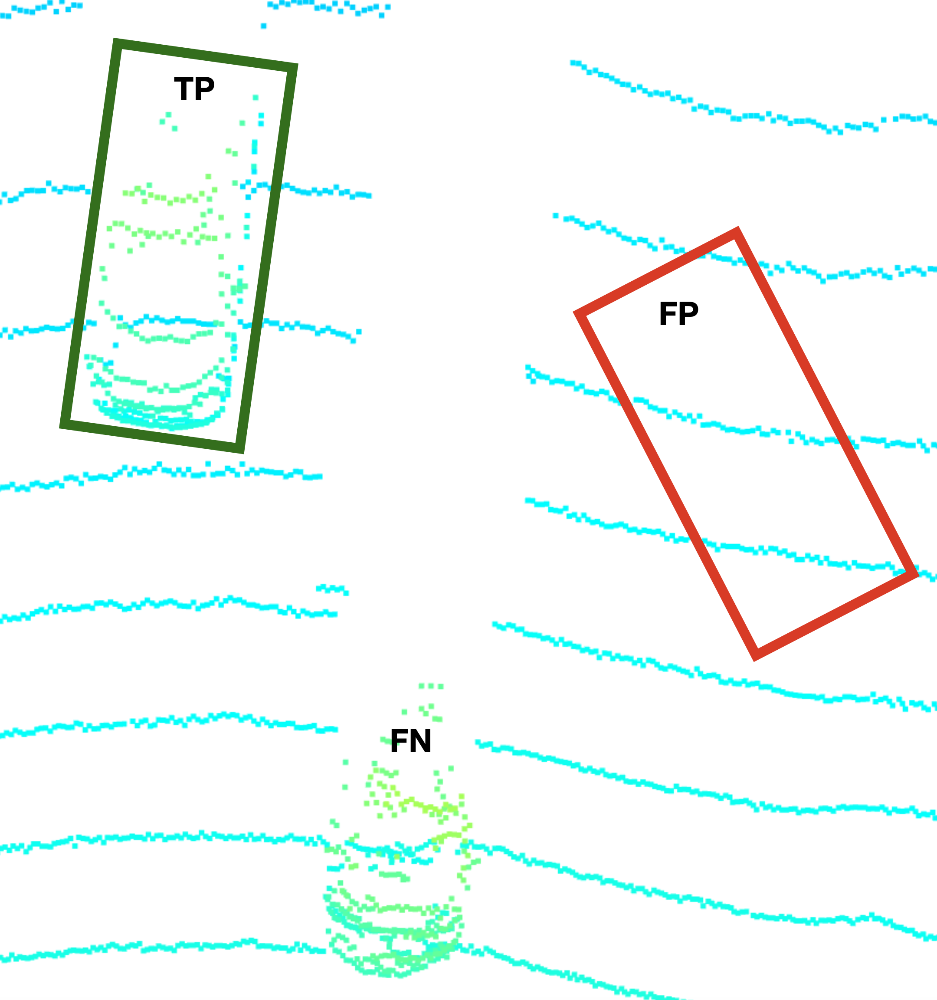

The bounding box labelled "TP" shows a correct detection: It encloses an actual object and both the shape as well as the heading are accurate. This is called a "true positive", where "positive" denotes the presence of an object as seen by the detector. On the right, there is a red bounding box labelled "FP", which does not contain any object and thus is a false detection. Such erroneous objects are called "false positive", as the detector wrongly believes in the existence of an actual object. Further, at the bottom of the image, there is an object clearly visible in the point cloud, but the detector has not found it. Such missed detections are called "false negatives", where "negative" means that the detector believes in the absence of an object. In a medicinal trial, where patients are tested for a specific illness, the following would hold:

- TP : Patient actually has the illness and the test result was positive
- FP : Patient does not have the illness, but the test was positive nonetheless
- FN : Patient has the illness, but the test was wrongly negative

Lastly, there is the case where the patient does not have the illness and the test correctly returns a negative result. This is referred to as "true negative" (TN). In object detection, this would mean that there is no object present in a scene and the detector has correctly not returned a detection. These four states can be arranged in a matrix, which is called "confusion matrix" in machine learning:

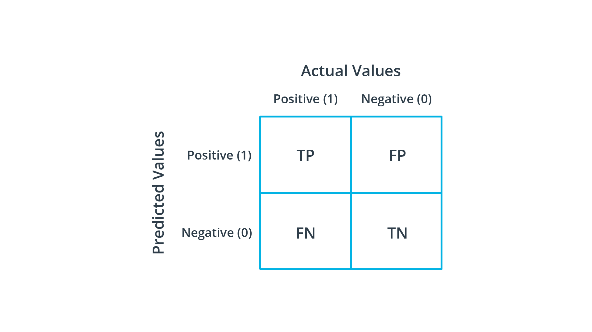

Note that the cases, where the predicted values are congruent with the actual values lie on the main diagonal of the matrix.

### 3. Precision and Recall

Imagine that we wanted to assess the detection algorithm used in the example above in a meaningful way. Two questions we might ask could be:

1. What is the probability that an object found by the algorithm actually corresponds to a real object?
2. What is the probability for a real object to be found by the detector?

Let us try to answer the first question based on the positives and negatives: In order to arrive at this probability, we need to divide the true positives by the number of all detections, which is the sum of the true positives and the false positives. This ratio is called "precision" $P = TP/(TP + FP)$.

In practice, precision is also sometimes referred to as "positive predictive value" (PPV).

The second question can be answered in a similar way: In order to compute the probability for detecting an actual object, we need to divide the number of actual detections by the sum of actual detections and missed detections. This measure is called "recall" $R = TP / (TP + FN)$.

In object detection though, accuracy is not used as the number of true negatives does not correspond to a meaningful detector behavior. The state "there is no object and the detector has not detected one" would hold for all areas of a scene without detection and without objects. In practice, we require the presence of an object, be it from a detector or from a trusted source such as a human observer, to derive the states TP, FP and FN.

### 4. Intersection-over-Union (IoU)

In the previous examples, we have taken for granted that some entity would provide us with the information whether a detection was a TP, FP or FN. In practice however, things are not so easy. In order to classify detections into these categories, several steps need to be taken:

1. Provide a list of human-generated detections, which serve as ground-truth. Such detections are often referred to as "labels".
2. Match the list of detections provided by the algorithm that we want to evaluate with the list of ground-truth labels.
3. Decide whether a certain detection is a TP, FP or FN based on the degree of overlap between detection and ground-truth label.

Take a look at the point cloud from the previous example, which now contains bounding boxes generated by the detector (red) as well as ground-truth labels (green).

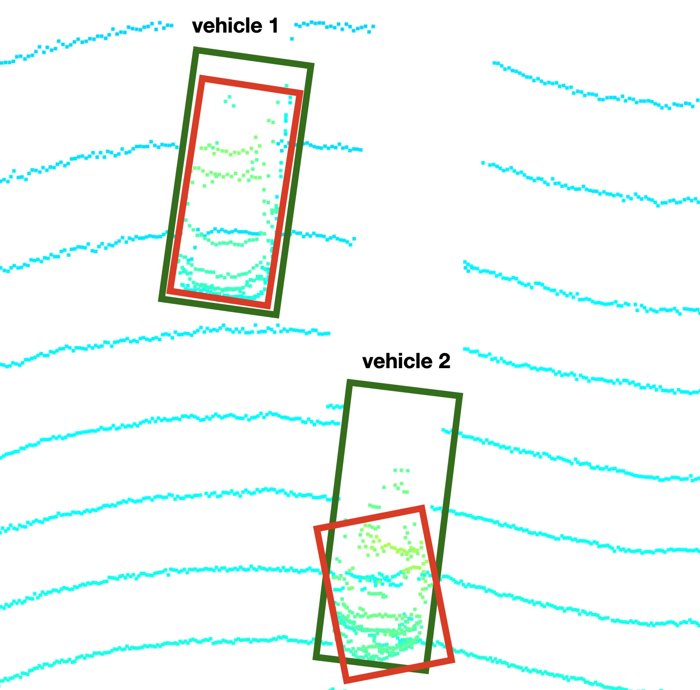

As you can see, the bounding boxes for vehicle 1 are very similar in both shape and size, with the detection-based bounding box slightly smaller than the human-labelled bounding box. For vehicle 2 though, the overlap between the two boxes is significantly smaller due to differences in shape, scale and angle.

In order to assess the detector in a meaningful way though, we need to decide whether a ground-truth label and a detection result are treated as a match - or not. In practice, we use a measure called "Intersection-over-Union" (IoU) to decide whether to assign two bounding boxes. The idea is to measure the degree of overlap between each bounding box returned by the detector and all ground-truth bounding boxes in such a way that the area of intersection and the area of the union of both rectangles is computed. The following figure illustrates the concept:

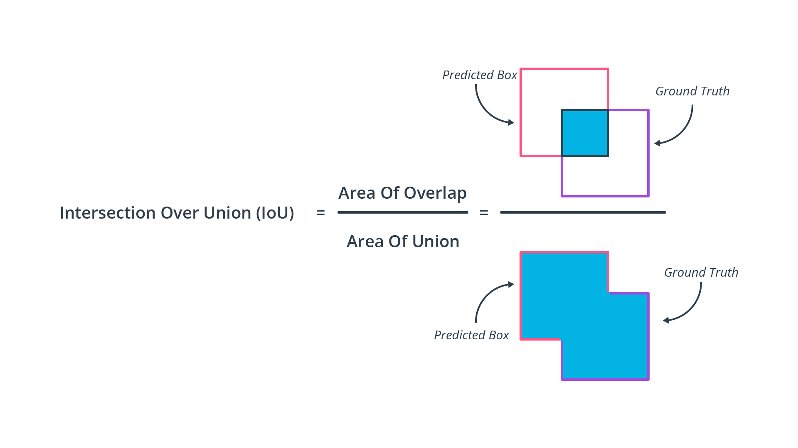

As you can see, the smaller the overlap between detection and ground truth, the smaller will be the Intersection-over-Union. In case there is no overlap at all, the IoU will be at 0.0 while for a perfect match, the IoU will be 1.0. In practice, we need to decide on an "appropriate" threshold for the IoU when matching detections and ground-truth labels. For example, if the IoU threshold is 0.5 and the IoU value for a certain label-detection match is 0.7, then we classify it as TP. On the other hand, when the IoU is below the threshold, e.g. at 0.3, we classify the corresponding detection as FP. In case there are ground-truth labels, for which there are no detections at all, these are classified as FN.

Based on the IoU threshold, the values for precision and recall will change, since at a low threshold it is expected that many detections will be matched with labels, resulting in a high number of TP. In most benchmarks (e.g. KITTI, Waymo), the required minimum IoU is 70% for vehicles. But before we investigate the idea of varying the IoU any further, let us first take a look at the concept of precision-recall curves, which is the next step on our way to compute the "average precision" of a detector.

### 5. Precision-Recall Curve

As mentioned previously, there is an inverse relationship between precision and recall, which is dependent on the threshold we choose for object detection. Let us take a look at the following figure, which shows the precision-recall curves of various object detection algorithms (each color represents a different algorithm):

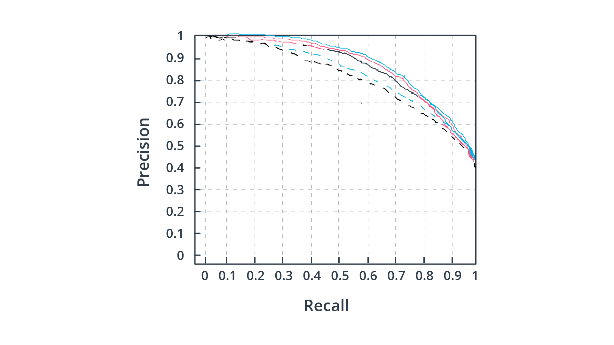

The curves are generated by varying the detection threshold from 0.0 to 1.0 and by computing precision and recall for each setting. Based on this metric, the solid blue curve shows the best performance, as the precision (i.e. the likelihood that a detection actually corresponds to a real object) drops the least for increasing recall values. Ideally, precision would stay at 1.0 until a recall of 1.0 has been reached. Thus, another way of looking at these curves would be to compare detectors based on the area under the curve: Thus, the larger the integral of the precision-recall curve, the higher the detector performance. Based on the precision-recall curve, engineers can make an informed decision on the detector threshold setting they want to choose by considering the demands of their application in terms of precision and recall.

### 6. Average Precision

The idea of the average precision (AP) metric is to compact the information within the precision-recall curve into a single number, which can be used to easily compare algorithms with each other. This goal is achieved by summing the precision values for different (=11) equally spaced recall values:


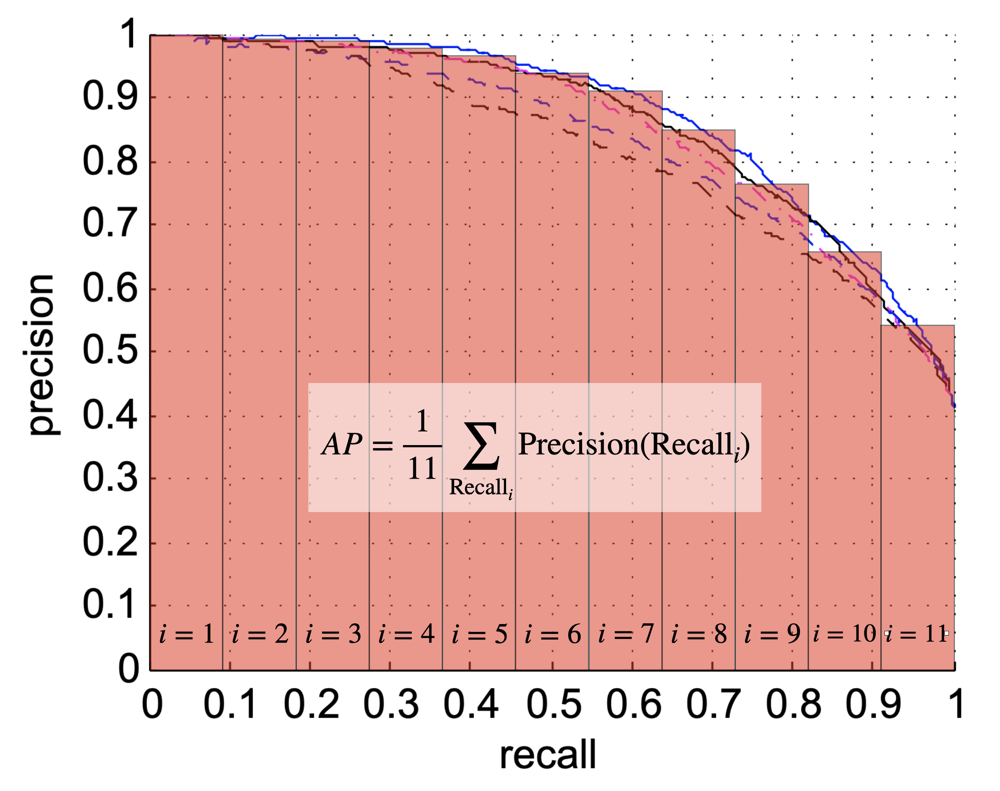

Note that in practice, varying the threshold level in equally spaced increments does not correspond to equally spaced increases in recall. The AP score for an algorithm varies between 0.0 and 1.0 with the latter being a perfect result.

### 7. Mean Average Precision (mAP)

Now that you have an understanding of how the shape of the precision-recall curve is compacted into a single number for easy comparison, we can take the final step and add one more layer of complexity: Based on the observation that changing the IoU threshold affects both precision and recall, the idea of the mean average precision (mAP) measure is to compute the AP scores for various IoU thresholds and then computing the mean from these values. The following figure shows precision-recall curves for several settings of the IoU threshold:

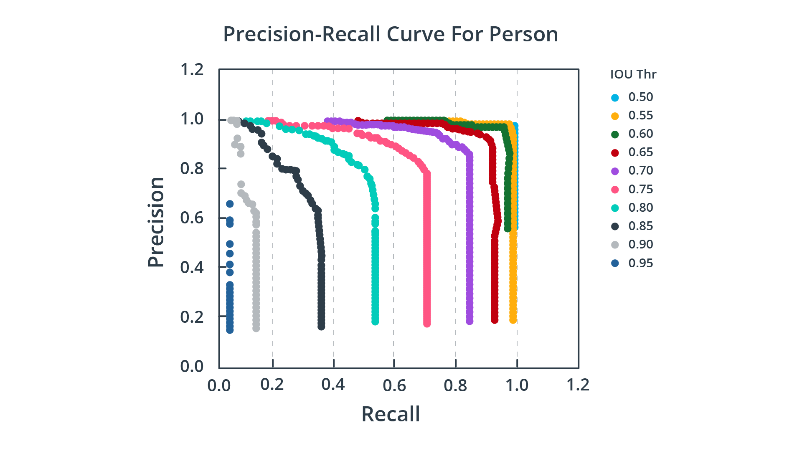

As can be seen, the shape of the curve approaches a rectangle for decreasing IoU thresholds.

Also, some ranking sites not only consider IoU thresholds but various object classes as well. In the PASCAL VOC 2007 challenge for example, only a single IoU setting (0.5) and 20 object classes were considered. In the COCO 2017 challenge on the other hand, the mAP was averaged over 10 IoU settings and 80 object classes.

## VI. Implementing Precision and Recall

### 1. Extracting labels from the Waymo Open dataset

In this section, I will show you how to load the ground-truth labels for a specific sensor from a Waymo frame. The following list shows you the layout of a label:

```
`-- Label
    |-- Box
    |   |-- center_x
    |   |-- center_y
    |   |-- center_z
    |   |-- length
    |   |-- width
    |   |-- height
    |   `-- heading
    |-- Metadata
    |   |-- speed_x
    |   |-- speed_y
    |   |-- accel_x
    |   `-- accel_y
    |-- type
    |-- id
    |-- detection_difficulty_level
    `-- tracking_difficulty_level
```

As you can see, each label contains a bounding box with 7 parameters that describes the position, shape and heading of the associated object. Also, there is information available on both speed and acceleration within the `Metadata` sub-branch. Finally, each label is associated with a type (e.g. TYPE_VEHICLE), with a unique identifier as well as information on the detection and tracking difficulty level. These two are important in the performance evaluation because some objects might not be visible to a sensor (e.g. a vehicle parked behind a wall) and therefore should not be counted negatively towards the sensor performance.

### 2. Example C2-4-3 : Display label bounding boxes on top of BEV map

In the next step, we will display the label bounding boxes as an overlay atop the BEV map. With the following code, you can load a pre-computed map from file:

```python
lidar_bev = load_object_from_file(results_fullpath, data_filename, 'lidar_bev', cnt_frame)
```

Then, you will need to convert the BEV map from a tensor format into an 8 bit data structure, so that we can display it using the OpenCV:

```python3
bev_map = (bev_map.squeeze().permute(1, 2, 0).numpy() * 255).astype(np.uint8)
bev_map = cv2.resize(bev_map, (configs.bev_width, configs.bev_height))

bev_map = cv2.rotate(bev_map, cv2.ROTATE_180)
cv2.imshow("BEV map", bev_map)
```

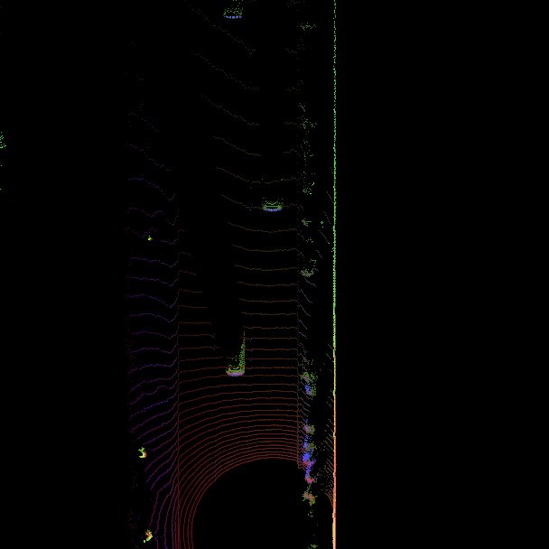

The BEV map shown here unites the individual height, intensity and density maps into one color image.

### 3. Example C2-4-4 : Display detected objects on top of BEV map

Next, we need to extract the actual bounding box from all labels and overlay it onto the BEV image. To do this, you can make use of two helper functions, which perform a format conversion from Waymo bounding box format into the format used in the detection and tracking modules and then perform the actual projection:

```python3
label_objects = tools.convert_labels_into_objects(labels, configs)
tools.project_detections_into_bev(bev_map, label_objects, configs, [0,255,0])
```

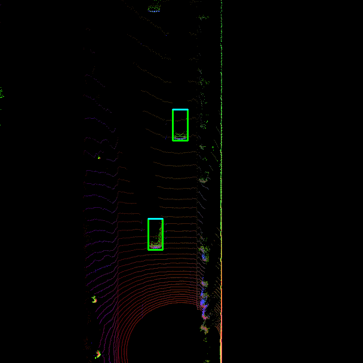

### 4. Loading pre-computed detections

In the next step, we will load the pre-computed object detections from file and layer it over the BEV map in the same manner as with the labels. To do this, we first need to issue the following commands:

```python3
detections = load_object_from_file(results_fullpath, data_filename, 'detections', cnt_frame)
tools.project_detections_into_bev(bev_map, detections, configs, [0,0,255])
```

Note that in the upcoming mid-term project you will implement the actual code to compute both binary and detected objects. For now though, as we are focussing on the evaluation process, it is sufficient to simply use both as-is and not be concerned with too many details regarding their implementation at this point.

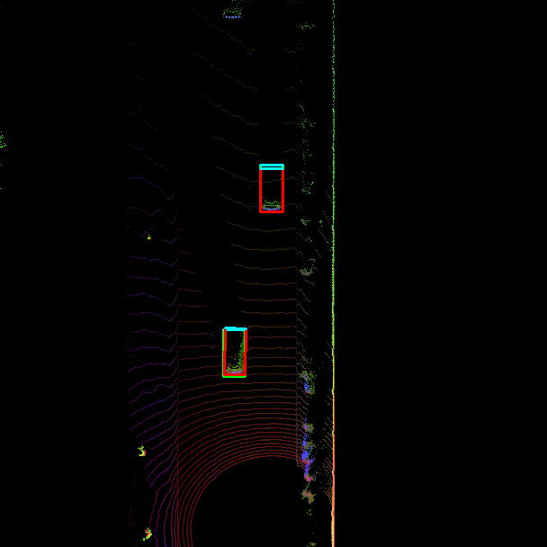

As you can see from the image, both vehicles have been detected successfully by the detection algorithm and are thus true positives (TP). As there are no missed detections (FN) or phantom objects (FP), the detector scores perfectly for this single frame. Given another sequence though, things look different:

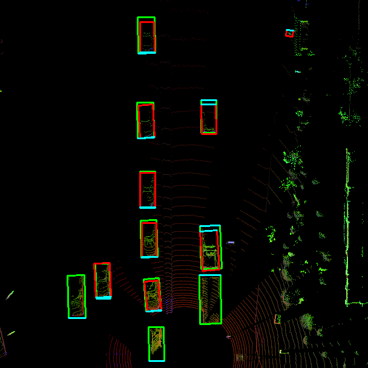

### 5. Computing recall and precision

Obviously, a single frame is not sufficient to compute reliable estimates for precision and recall. So in order to get more meaningful results, we need to analyze a larger number of frames. As manual processing, such as with the single image from the previous exercise, is not feasible for large datasets, the evaluation needs to be automated. In order to do this, the label boxes need to be paired with the detection boxes in a way that for each box, the match with largest overlap (=IoU) is kept. For this purpose, I have created a large number of pre-computed files which contain TP, FP and FN for ~200 frames of sequence 1 for several settings of the confidence threshold level used in object detection to decide when to keep object candidates. Note that the actual code to perform the matching is a part of the mid-term project.

In order to load the results for a single frame, we need to execute the following code for every frame:

```python3
conf_thresh = 0.5
det_performance = load_object_from_file(results_fullpath, data_filename, 'det_performance_' + str(conf_thresh), cnt_frame)
det_performance_all.append(det_performance)
```

Note that in the second line, a variable containing the current confidence threshold (used for object detection) is appended. This makes it possible to load the TP, FP and FN for various confidence levels such that we can arrive at an estimate of the average precision. For now though, we will only use a single setting. The third line appends the performance results of the current frame to a list containing all previous results, such that at the end of the loop over all frames, `det_performance_all` contains all of the TP, TN and FN of the entire sequence.

## Summary

In this section, you will find a list of abbreviations and technical expressions used in the lesson. For further details and an in-depth explanation, please refer to the respective sections.

- Frustum : In geometry, a frustum is the portion of a cone or pyramid that lies between one or two parallel planes cutting it.
- Voxel : (Volume Element) Represents a value on a regular grid in three-dimensional space.
- MLP : multi-layer perceptrons
- CNN : Convolutional Neural Networks
- YOLO : "You Only Look Once" is a system for detecting objects based on deep-learning.
- BEV : Birds-eye view
- TP : True positive
- TN : True negative
- FP : False positive
- FN : False negative
- IoU : Intersection-over-Union
- mAP : Mean Average Precision