# THE LIDAR SENSOR

## I. The roles of Lidar in AD

## II. Comparison - Lidar, Radar and Camera

1. Range:
- LiDAR: Detects objects from a few meters to over 200m, but struggles with close distances.
- Radar: Detects objects from less than 1m to over 200m, depending on range type (long, mid, short).
- Cameras: Mono cameras can't reliably measure distance; stereo cameras can, but only up to 80m.

2. Spatial Resolution:
- LiDAR: High spatial resolution (~0.1°) allows detailed 3D scans.
- Radar: Poor at resolving small features, especially at longer distances.
- Cameras: Resolution depends on optics, pixel size, and signal-to-noise ratio. Loses detail in poor lighting or when objects are too far away.

3. Robustness in Darkness:
- LiDAR & Radar: Excellent performance at night since they are active sensors.
- Cameras: Reduced performance at night due to reliance on ambient light.

4. Robustness in Adverse Weather:
- Radar: Not significantly affected by rain, snow, fog, or sand.
- LiDAR & Cameras: Performance degrades in adverse weather due to their reliance on optical systems.

5. Object Classification:
- Cameras: Best for classifying objects like vehicles, pedestrians, and signs.
- LiDAR: Can classify objects to a certain extent using 3D point clouds.
- Radar: Limited object classification ability.

6. Perceiving 2D Structures:
- Cameras: The only sensor capable of interpreting 2D structures like lane markings, speed signs, and traffic lights.

7. Measuring Speed:
- Radar: Directly measures object velocity using Doppler shift.
- LiDAR: Estimates speed using successive distance measurements, less accurate.
- Cameras: Can measure time to collision through object displacement on the image plane.

8. System Cost:
- Radar & Mono Cameras: Affordable, with radar systems being compact.
- Stereo Cameras: More expensive due to higher hardware costs.
- LiDAR: Prices have dropped dramatically, with potential to fall below US$500 soon.

9. Package Size:
- Radar & Mono Cameras: Easy to integrate into vehicles.
- Stereo Cameras: Bulky and harder to integrate, sometimes obstructing the driver's view.
- LiDAR: Available in various sizes; 360° scanning models are large but new solid-state versions are smaller.

10. Computational Requirements:
- LiDAR & Radar: Low computational demand.
- Cameras: Require significant processing to extract useful data, increasing system costs.

| | Range measurement | Spatial Resolution | Robustness in daylight | Robustness in darkness | Robustness in rain/snow/fog | Classification in objects | Perceiving 2D structures | Measure speed / TTC | Package size | System cost | Computational requirements |
| - | - | - | - | - | - | - | - | - | - | - | - |
| **Camera** | - | + | + | - | - | ++ | ++ | + | + | + | - |
| **Radar** | ++ | - | ++ | ++ | ++ | - | - | ++ | + | + | + |
| **Lidar** | + | ++ | + | ++ | + | + | - | + | - | - | ++ |

## III. Waymo Lidar system & dataset

### 1. Lidar system

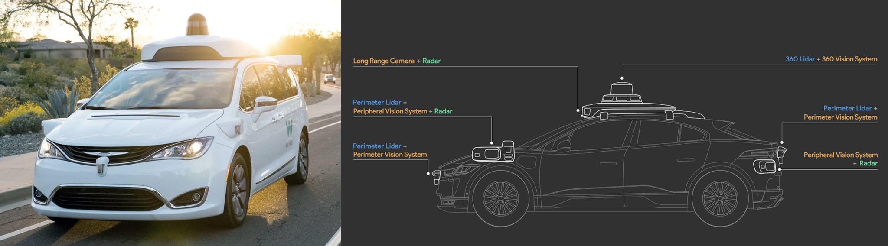

The LiDAR sensors can be categorized into two broad groups:

#### **a. Perimeter Lidar**
- Vertical field of vision: -90&deg; to +30&deg;
- Range: 0-20 m.
- Those parameters are only reflected in Waymo Dataset. The actual parameters in real-life might be higher.

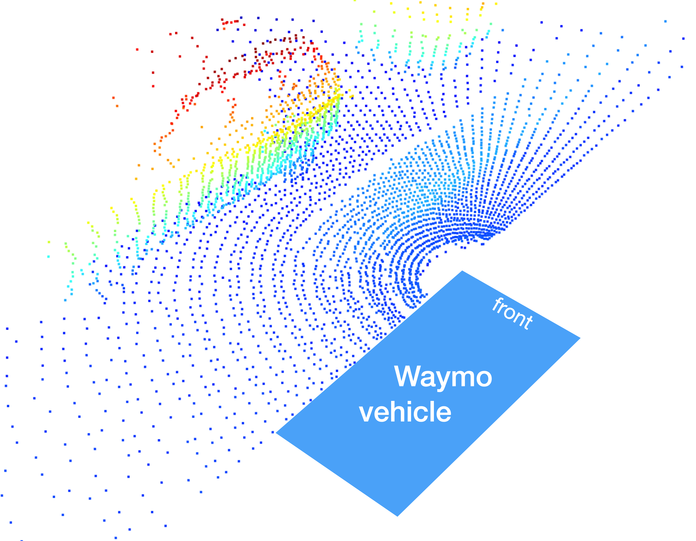

Waymo Front-Left LiDAR 3D Point-Cloud

#### **b. 360 Lidar**
- Vertical field of vision: -17.6&deg; to +2.4&deg;
- Range: 75 m.
- Those parameters are only reflected in Waymo Dataset. The actual parameters in real-life might be higher.

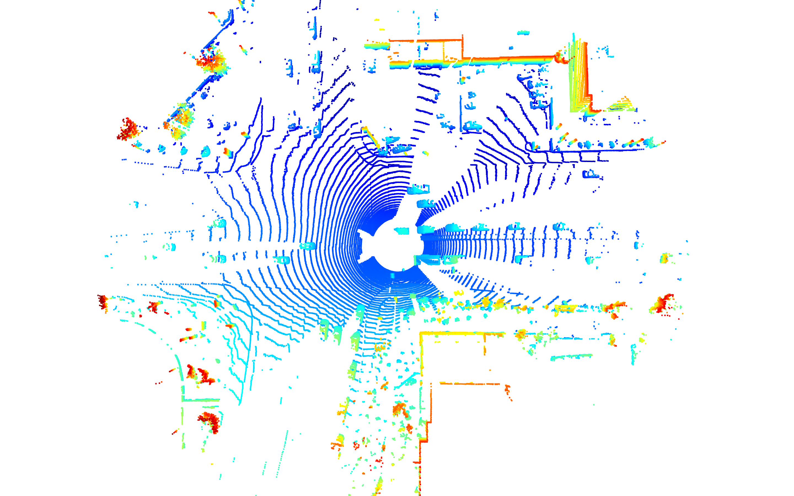

Waymo Top LiDAR 3D Point-Cloud

Two aspects are noteworthy here: (1) the distance between adjacent scanner lines increases with growing distance and (b) the area in the direct circumference of the vehicle does not contain any 3d points. Both observations can be easily explained by a look at the geometry of the sensor-vehicle setup:

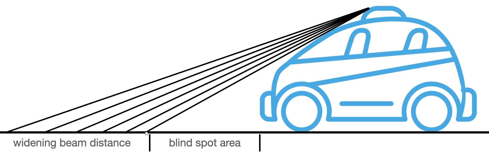

Directly in front of the vehicle, there is a large gap in perception ("blind spot") due to the occlusion of the laser beam by the vehicle. Also, it can be seen that the gap between adjacent beams is widening with distance due to the fixed angle in which laser diodes are positioned vertically.

### 2. Lidar technical properties

The most common LiDAR sensor used today is called a "**pulsed LiDAR**". It is a system consisting of a laser source and a receiver with the source emitting short bursts of tight laser beams into a scene. When a beam hits an object, a fraction of the laser light is refracted back to the LiDAR sensor and can be detected by the receiver. Based on the time of flight of the laser light, the range `R` to the target can be computed using the equation:

$$
R = {1 \over 2n} c \Delta t
$$

In which $c$ is speed of light in vacuum, `n`n is index of refraction of propagation medium (1.0 for air).

Below is Lidar sensor component:

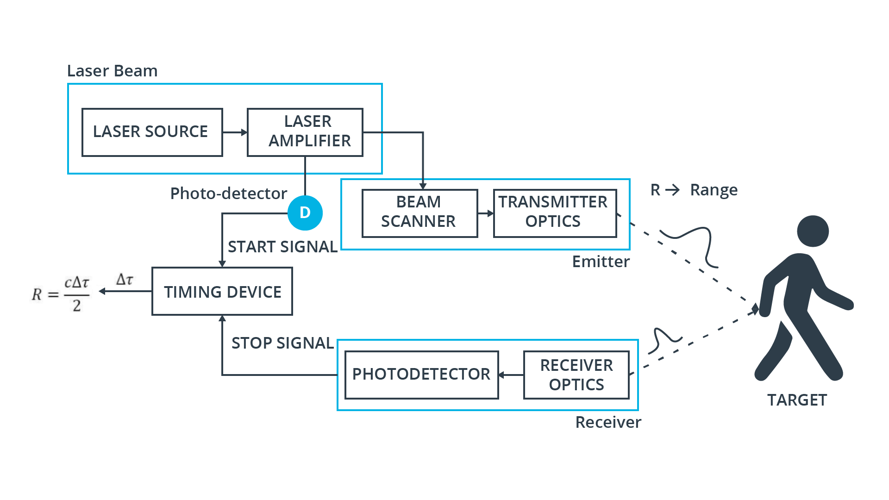

In order to accurately measure the time between beam emission and detection, a very precise clock is needed. As can be seen from the following figure, a **leading edge thresholding** technique is used on the voltage signal to detect the moment in time, when the laser pulse returns.

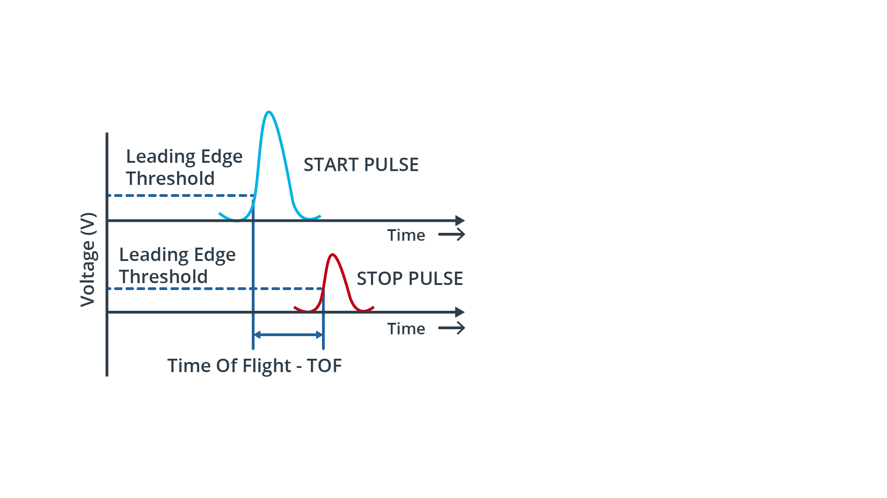

The attainable **range resolution** is directly proportional to the resolution of the timing device. A typical resolution value of the time interval measurement can be assumed to be in the 0.1 ns range, which results in a range resolution of 1.5 cm.

The **maximum range** at which a target can be detected is mainly determined by the energy losses of the laser beam during its travel through the atmosphere. The lower the return energy and the higher the ambient noise, the harder it is for the receiver to detect a clear flank. The ratio between signal energy and background noise is described by the signal-to-noise-ratio (SNR), which is shown for several signals returned from targets at varying distances.

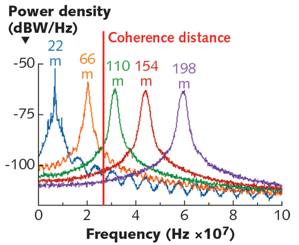

It can also be seen from the figure, that the signal peaks flatten out in proportion to the target distance, which is caused by a lack of beam coherence. This effect is referred to as **"beam divergence"** and it is directly proportional to the wavelength $\lambda$ of the laser light. For a LiDAR with $\lambda = 1550nm$, the smallest resolvable feature size in lateral direction due to beam divergence is $4 cm$ at 100 m.

Despite of the discussed limitations, time-of-flight pulsed LiDAR systems are the most frequently selected type (at present) for use in autonomous vehicles, mainly due to their simplicity and their capability to perform well outdoors, even under challenging environmental conditions.

Other time-of-flight methods are radar and ultrasound. Of these three ToF techniques, LiDAR provides the highest angular resolution, because of its significantly smaller beam divergence. It thus allows a better separation of adjacent objects in a scene, as illustrated in the following figure:

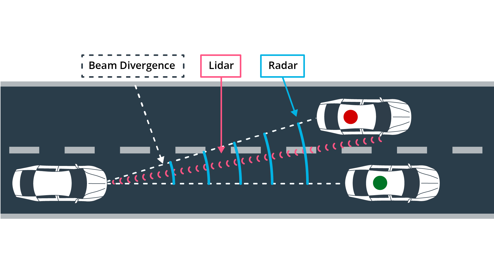

### 3. Overview of Lidar types

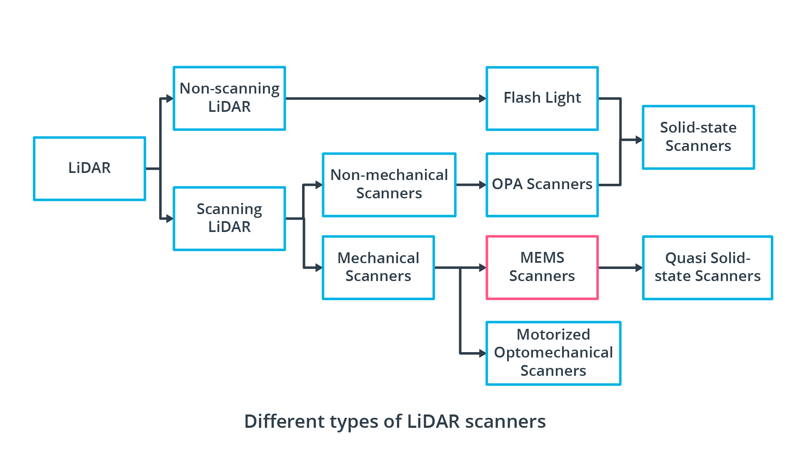

#### a. Scanning Lidar - Motorized Opto-Mechanical Scanning

Motorized optomechanical scanners are the most common type of LiDAR scanners. In 2007, the company Velodyne, a pioneer in LiDAR technology, released a 64-beam rotating line scanner, which has clearly shaped and dominated the autonomous vehicle industry in their early years. The most obvious advantages of this scanner type are its long ranging distance, the wide horizontal field-of-view and the fast scanning speed.

With most sensors of this type, there are several transmitter-receiver channels, which are stacked vertically and rotated by a motor to create a 360° field-of-view.

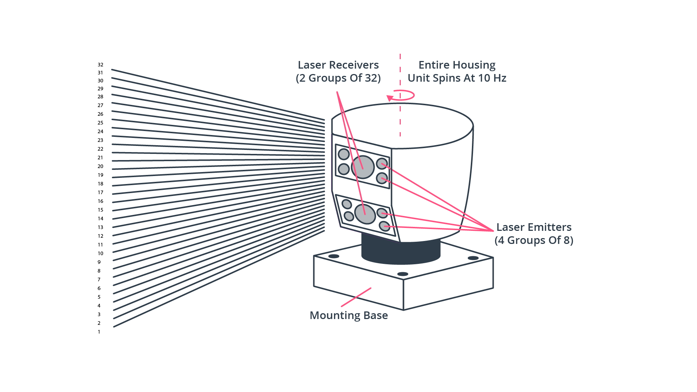

The following figure shows a product line-up of Velodyne LiDARs, which illustrate the evolution of package size:

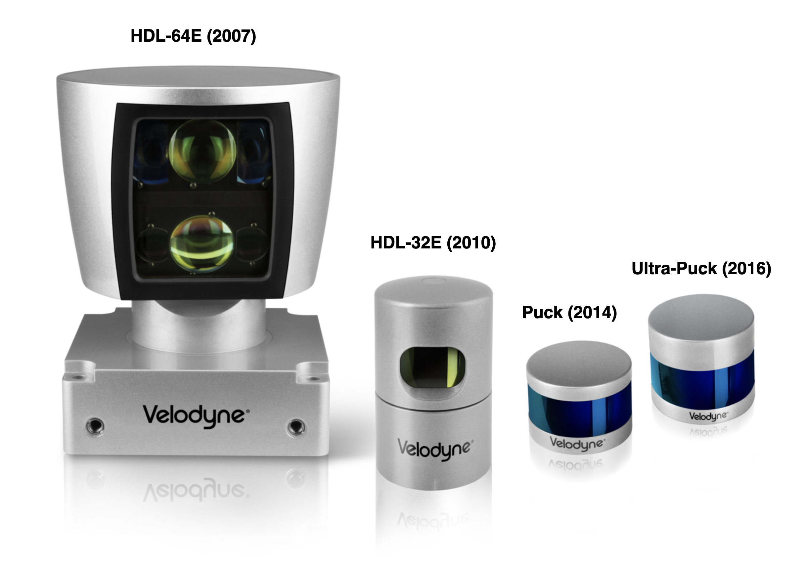

#### b. Non-scanning Lidar - Flash

This LiDAR type does not perform a sequential reconstruction of a scene by redirecting laser beams but instead illuminates everything at once, similar to a camera using a flash-light. Within such a **flash LiDAR**, an array of photodetectors simultaneously picks up the time-of-flight of each individual laser beam, providing a series of depth images where each pixel has been captured at the same time instant. As there are no moving parts, this sensor type is also referred to as "solid-state LiDAR".

Since this method captures the entire scene in a single image compared to the mechanical laser scanning method, the data capture rate is much faster. Also, as each image is captured in a single flash, this scanning type achieves a higher robustness towards vibrations, which could otherwise distort the scanning process. The following figure visualizes the basic principle and compares it to the standard line-scanning technique we have already discussed previously as well as to a sequential raster-scanning technique in two dimensions.

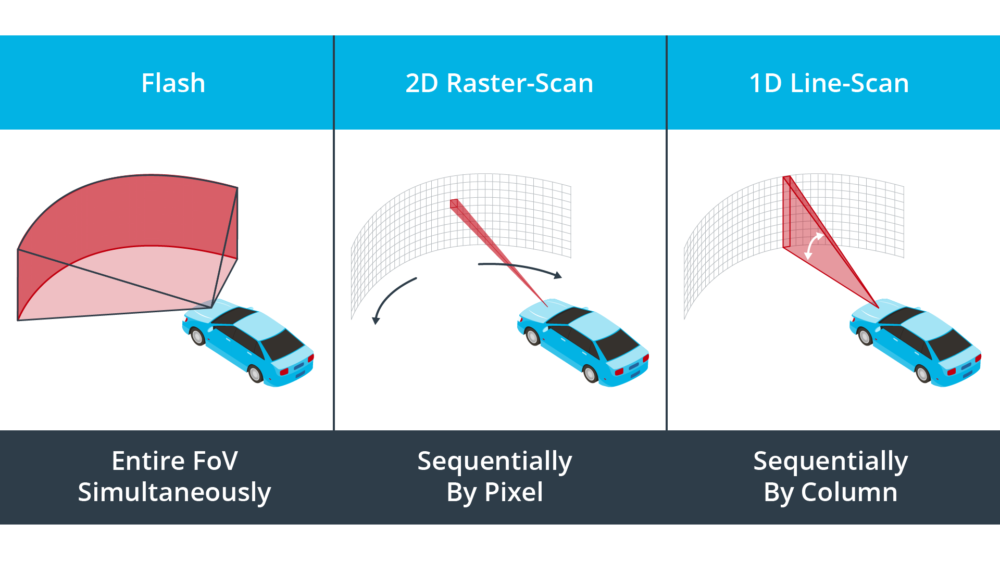

Another sensor type belonging to the class of solid-state sensors is the **Optical Phased Array (OPA)** LiDAR. Other than flash LiDAR though, this sensor belongs to the class of scanning LiDARs, as the position of laser beam in the scene is actively directed. In an OPA system, an optical phase modulator is used to control the speed of light passing through the lens. OPA systems are able to shape the wave-front by delaying individual beams by varying amounts, which effectively steers the laser beam into different directions.

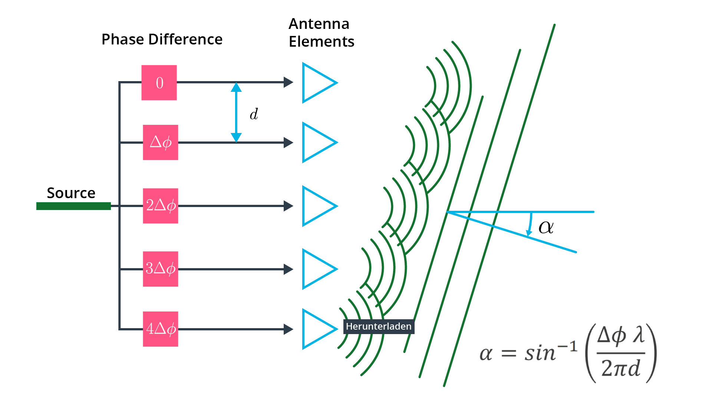

