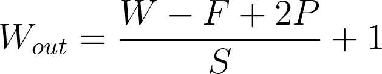
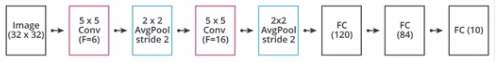
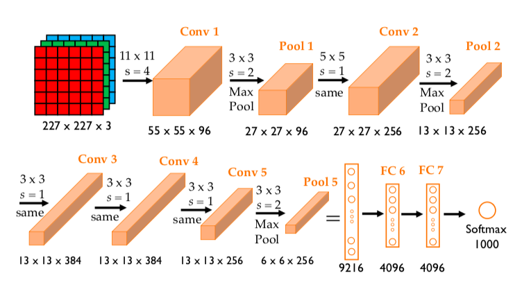
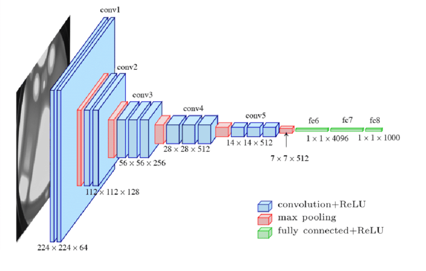
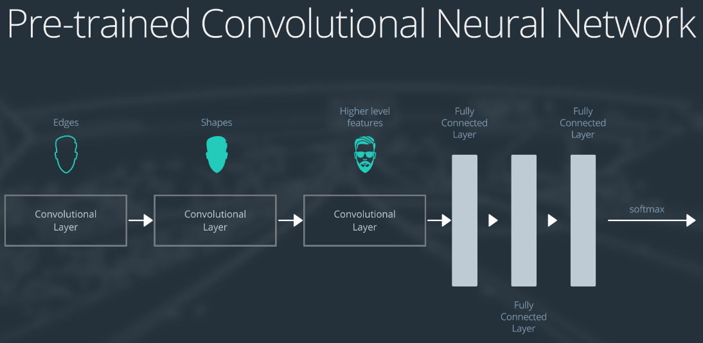
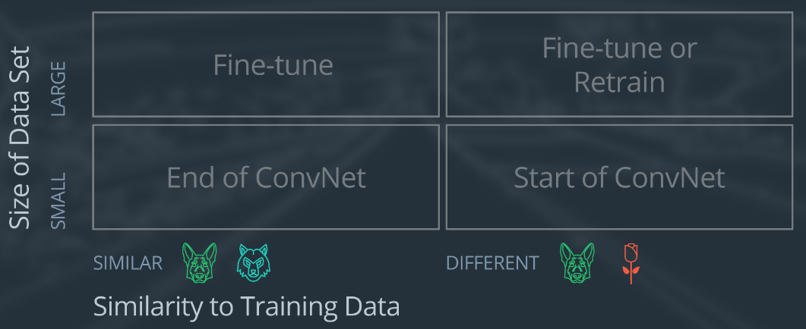
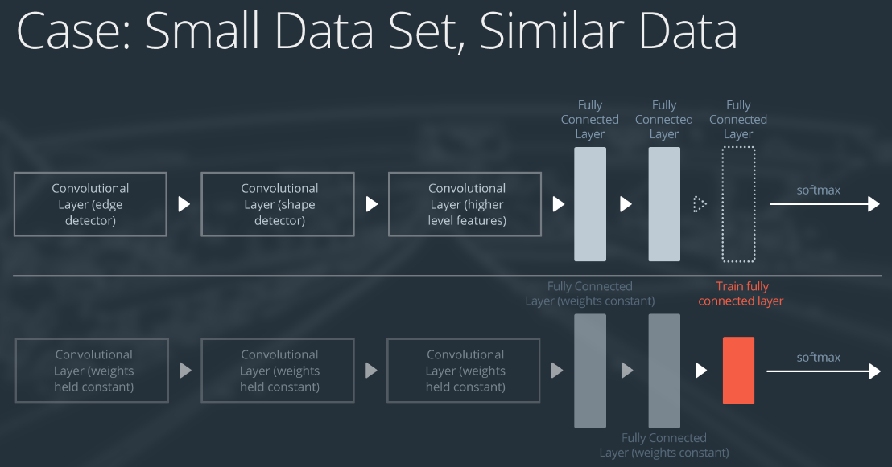
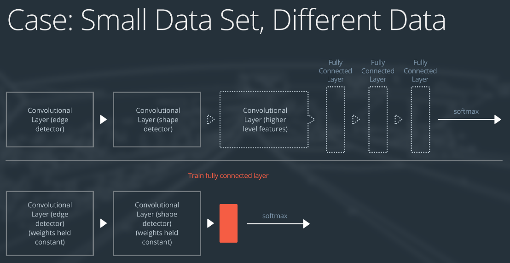
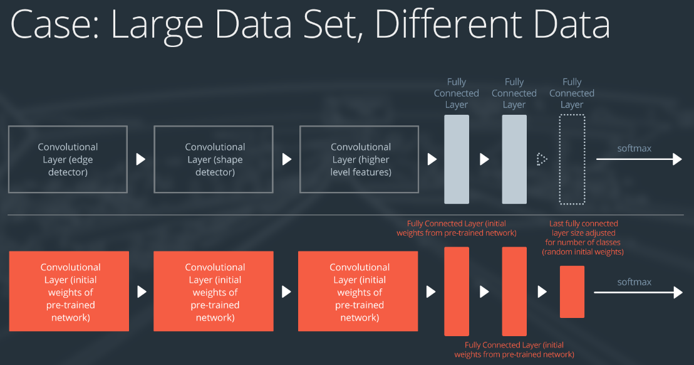

# IMAGE CLASSIFICATION WITH CNN

## I. Limitations of FFNN

- Flattening the image is required to use it as an input to a fully connected layer. In the previous lesson, we saw that a fully connected layer of $n$ neurons following a layer of $m$ neurons has $(m+1)xn$ parameters.

- If our network has a single layer of 10 neurons and if we are using images of resolution 64x64x3, this layer will have 122880 weights and 10 biases. This is not going to scale well with more layers, more neurons and a higher image resolution. Thankfully, convolutional layers will help solve this problem!

- Instead of flattening the image, we are now considering the image as an input volume. The convolutional layer, as opposed to the fully connected layer, will be **locally connected**. Indeed, **each neuron in the convolutional layer will only be connected to small portion of the input volume**.

## II. Convolutional Layers

### 1. Introduction

- A convolutional layer is made of **filters**. Such filters are `HxWxD` arrays of learnable weights that are sliding or convolving over the input volume. Each filter is convolved over the entire input volume. The convolution of such a filter creates an 2D output array called a feature map. Because a convolutional layer has multiple filters, it outputs multiple feature maps. They will be stacked together to create the output volume.

- The filters in a convolutional layer are defined by two hyperparameters: the height and width. They are usually small and the most common filter sizes are `3x3` or `5x5`.

### 2. Convolution operations

Output shape after a convolutional layer:

- `F` : filter size.
- `P` : padding size, controls the size of the output by adding zeros (or other values) to the border of the input.
- `S` : stride size, controls the size of the step by which the filter is moving.

### 3. ConvNet Layers and Parameters

- A filter acts as a **feature detector** in convolutional layers, and the deeper the layer, the more specialized the filters are. For example, when training an algorithm to classify dog and cat images, a filter in a deep layer might be a left ear detector.

- The number of parameters in a convolutional layer is determined by the filter size, the number of filters and the depth of the input volume `D`. If we consider a 3x3 filter size with 32 filters:

+ Each filter has 3x3xD + 1 learnable parameters
+ The whole layer has (3x3xD+1)x32 learnable parameters

- CNNs have in general a few millions parameters but some mobile-oriented architectures barely reach one million.

### 4. Pooling Layers

- Pooling layers are very common in CNNs. They decrease the number of parameters in the network by aggregating spatial information, usually by taking the mean (average pooling) or the max (max pooling). They do not have any learnable parameters.

### 5. Typical ConvNet Architectures

- Common pattern:
    + Conv layer
    + Activation
    + Pooling
    + Repeat this block

- Rules of thumb:
    + Increase number of conv filter with depth
    + Etc.

- First conv architecture: **LeNet-5**

### 6. Dropout and Batch Normalization

#### a. Dropout layer

- Dropout was introduced in a [2014 paper](https://jmlr.org/papers/volume15/srivastava14a/srivastava14a.pdf) as a way to prevent overfitting. Dropout can be used in fully connected or convolutional layers and simply randomly disable neurons during training. Dropout does not have any learnable parameters and has only one hyperparameter, the probability p of a neuron being disabled.

- It is important to note that Dropout does not behave similarly during training and testing. Indeed, because we want the behavior of our model to be deterministic in production, **dropout is turned off and neurons are not randomly disabled anymore**. The main consequence of this is the need to scale the neurons output. To be understand this, let us consider a simple fully connected layer containing 10 neurons. We are using a dropout probability of 0.5. Well during training, a neuron in the next fully connected layer will on average receive an input from 5 neurons. However, during testing, the same neurons will receive an input from 10 neurons. To get a similar behavior during training and testing, we need to scale the neuron's output by 0.5 during testing time.

In practice, we use something called inverted dropout, where scaling is happening during training. Why? Because we want the model to be as fast as possible when deployed, so we'd rather have even this small operation happen during training instead of at inference time.

#### b. Batch normalization

- **Batch Normalization** or Batchnorm was first introduced in a [2015 paper](https://arxiv.org/pdf/1502.03167). A batchnorm layers computes batch statistics and scales its inputs using these statistics.
- By doing so, Batchnorm improves the convergence time of neural networks. Similarly to Dropout, Batchnorm behaves differently during training and testing:
    + During training, this layer calculates an exponential moving average of batch statistics.
    + During testing, these statistics are used instead of the batch statistics from the test batches.

### 7. AlexNet

The Alexnet architecture was a critical breakthrough in the field of computer vision for deep learning. In this [2012 paper](https://proceedings.neurips.cc/paper/2012/file/c399862d3b9d6b76c8436e924a68c45b-Paper.pdf), the authors successfully used a CNN trained on GPU to classify images.

### 8. VGG

- In this [2015 paper](https://arxiv.org/pdf/1409.1556), the authors introduced two very important concepts:

    + Using smaller filter sizes, in this case 3x3 filters.
    + Using convolutional blocks: blocks of 2 or 3 convolutional layers followed by one pooling layer.

- By stacking multiple convolutional layers with small filters, we create a block that has less parameters than a single layer with larger filter sizes, while having the same effective receptive field and more non-linearities.

### 9. ResNet

- In another very important [paper published in 2015](), the authors introduced the Resnet architecture. They realized that networks with more layers started underperforming. To solve this and allow for deeper networks, the authors introduced the concept of **residual connections or skip connections**. A skip connection simply adds the input of a layer or a block of layers to its output. By doing so, it will alleviate gradient propagation issues linked to activation functions.

## III. Transfer Learning

Transfer learning involves taking a pre-trained neural network and adapting the neural network to a new, different data set. Basically, you take weights from a trained NN, then apply them to new different dataset.

A large data set might have one million images. A small data could have two-thousand images. The dividing line between a large data set and small data set is somewhat subjective. Overfitting is a concern when using transfer learning with a small data set.

Images of dogs and images of wolves would be considered similar; the images would share common characteristics. A data set of flower images would be different from a data set of dog images.

Each of the four transfer learning cases has its own approach. In the following sections, we will look at each case one by one.

To explain how each situation works, we will start with a generic pre-trained convolutional neural network and explain how to adjust the network for each case. Our example network contains three convolutional layers and three fully connected layers:

Depending on the size and similarity of new dataset compared to the original, the transfer learning approach will be different, with 4 main cases:

### 1. Small, similar

If the new data set is small and similar to the original training data:

1. Slice off the end of the neural network.
2. Add a new fully connected layer that matches the number of classes in the new data set.
3. Randomize the weights of the new fully connected layer; freeze all the weights from the pre-trained network.
4. Train the network to update the weights of the new fully connected layer.

To avoid overfitting on the small data set, the weights of the original network will be held constant rather than re-training the weights.

Since the data sets are similar, images from each data set will have similar higher level features. Therefore most or all of the pre-trained neural network layers already contain relevant information about the new data set and should be kept.

### 2. Small, different

If the new data set is small and different from the original training data:

1. Slice off most of the pre-trained layers near the beginning of the network.
2. Add to the remaining pre-trained layers a new fully connected layer that matches the number of classes in the new data set.
3. Randomize the weights of the new fully connected layer; freeze all the weights from the pre-trained network.
4. Train the network to update the weights of the new fully connected layer.

Because the data set is small, overfitting is still a concern. To combat overfitting, the weights of the original neural network will be held constant, like in the first case.

But the original training set and the new data set do not share higher level features. In this case, the new network will only use the layers containing lower level features.

### 3. Large, similar

If the new data set is large and similar to the original training data:

1. Remove the last fully connected layer and replace with a layer matching the number of classes in the new data set.
2. Randomly initialize the weights in the new fully connected layer.
3. Initialize the rest of the weights using the pre-trained weights.
4. Re-train the entire neural network.

Overfitting is not as much of a concern when training on a large data set; therefore, you can re-train all of the weights.

Because the original training set and the new data set share higher level features, the entire neural network is used as well.

### 4. Large, different

If the new data set is large and different from the original training data:

1. Remove the last fully connected layer and replace with a layer matching the number of classes in the new data set.
2. Retrain the network from scratch with randomly initialized weights.
3. Alternatively, you could just use the same strategy as the "large and similar" data case.

Even though the data set is different from the training data, initializing the weights from the pre-trained network might make training faster. So this case is exactly the same as the case with a large, similar data set.

If using the pre-trained network as a starting point does not produce a successful model, another option is to randomly initialize the convolutional neural network weights and train the network from scratch.

## IV. Data Augmentation

Data augmentation is a way to increase the variability in the training dataset without having to capture more images. By applying pixel-level and geometric transformations during training, we can artificially simulate different environments. For example, a blur filter could be used to mimic motion blur. The augmentations should be carefully chosen.

You can follow this [tutorial](https://www.tensorflow.org/tutorials/images/data_augmentation) to use data augmentation in Tensorflow. This approach is using the Keras API to create combinations of augmentations.

Many image augmentations libraries are available but one of the most popular is [Albumentations](https://albumentations.ai/docs/). It provides fast and easy ways to apply pixel-level and geometric transformations to images and labels, including bounding boxes.

## Glossary

- **Augmentations**: a way to artificially increase the diversity of a dataset by applying pixel-level and geometric transformations.
- **Batch Normalization**: a layer that uses batch statistics to scale its inputs and accelerate the overall convergence of a NN.
- **Convolutional layer**: a type of NN layer that is particularly well suited to analyze image data. This layer is made of filters convolving over an input volume.
- **Dropout**: a technique that randomly turns off neurons to prevent overfitting.
- **Feature map**: the 2D array resulting of a filter convolution over the input volume.
- **Padding**: the act of adding integers (often zeros) to the border of an image.
- **Pooling layer**: a layer that spatially aggregates information.
- **Stride**: the step size a computing window is shifted by.
- **Transfer Learning**: using pretrained networks as a starting point when training a new NN.